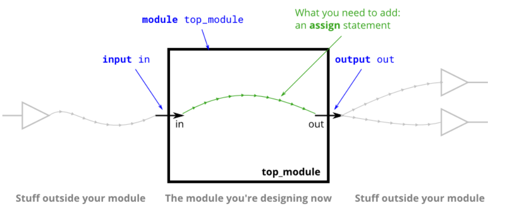
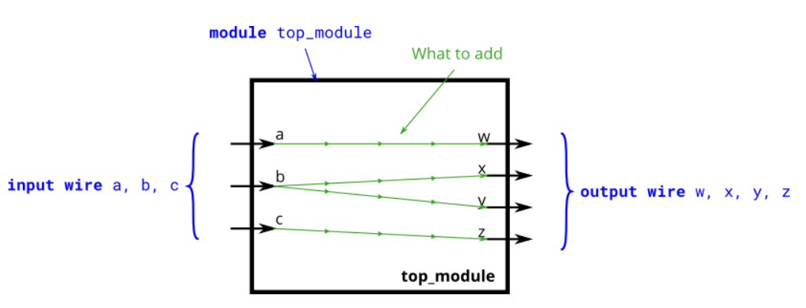
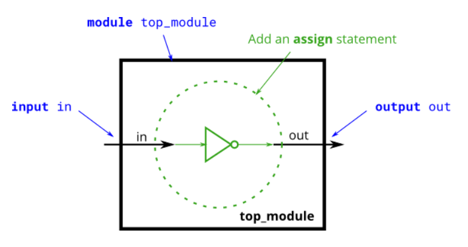
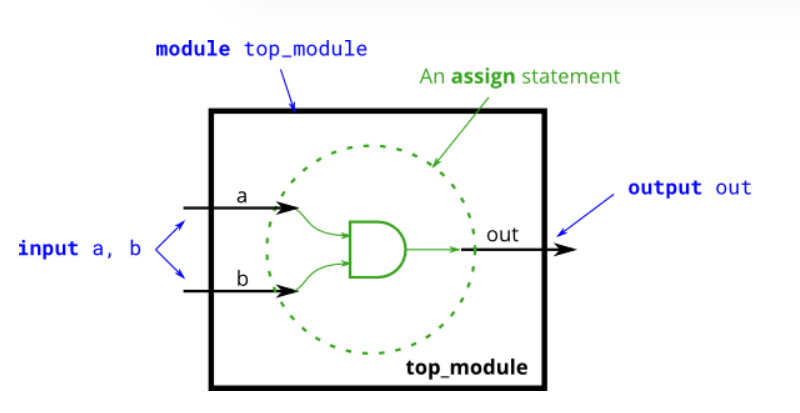
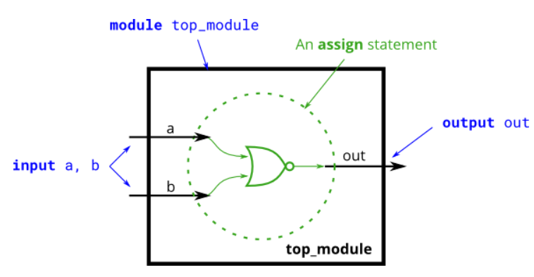
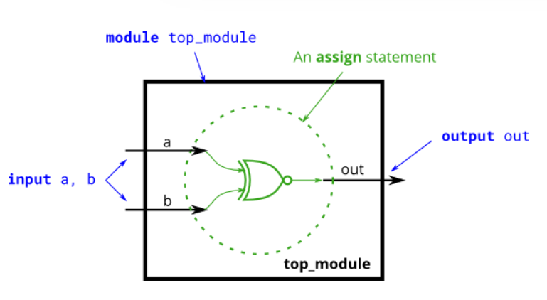
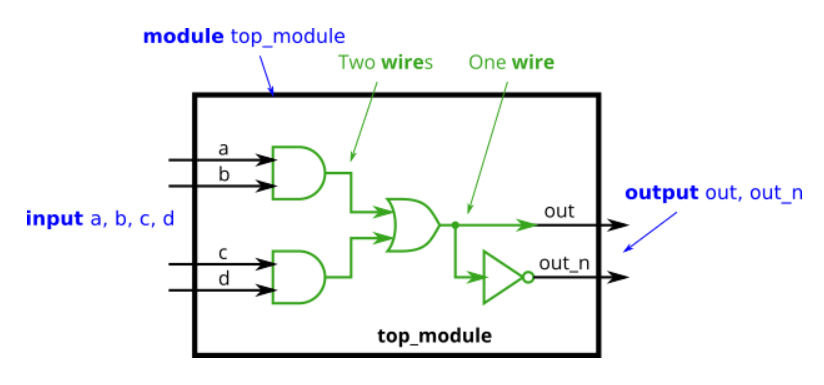
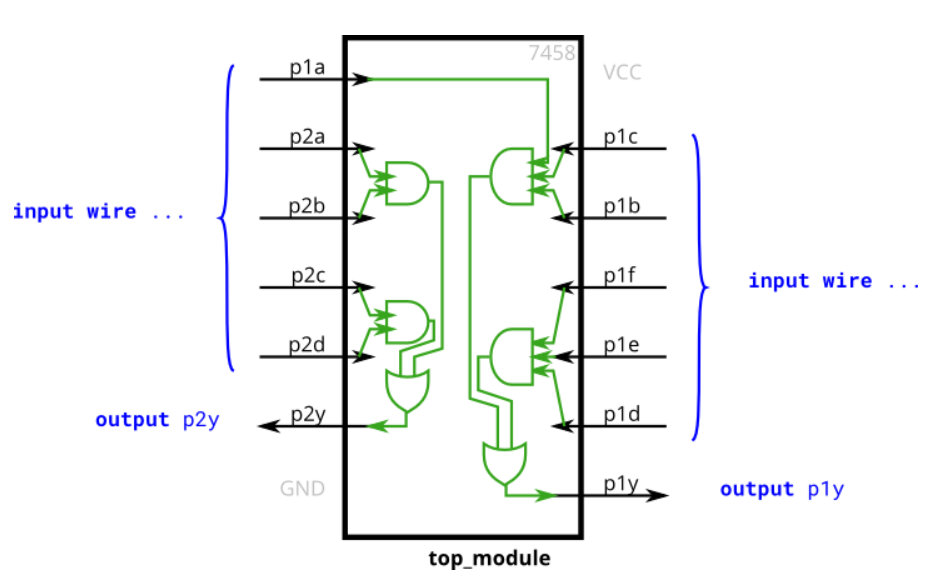

# Verilog Language -> Basics

## 3 Simple wire
<details>
<summary>详情</summary>

构建一个电路，没有输入端口，只有一个输出端口，输出端口时钟驱动逻辑 1 ，即逻辑高。     

  

**分析**  
无。

**答案**  
```
module top_module( output one );

// Insert your code here
    assign one = 1'b1;

endmodule
```

</details>

## 4 Four wires
<details>
<summary>详情</summary>

创建一个具有 3 个输入和 4 个输出的模块，其行为类似于进行这些连接的电线:  
- a -> w
- b -> x
- b -> y
- c -> z

  

**分析**  
无。

**答案**  
```
module top_module( 
    input a,b,c,
    output w,x,y,z );
	assign w = a;
    assign x = b;
    assign y = b;
    assign z = c;
endmodule
```

</details>

## 5 inverter
<details>
<summary>详情</summary>

创建一个实现非门（NOT）的模块。  
   

**分析**  
`非门`。

**答案**  
```
module top_module( input in, output out );
assign out = ~in;
endmodule
```

</details>

## 6 AND
<details>
<summary>详情</summary>

创建一个实现与门(AND)的模块。  
   

**分析**  
`与门`。

**答案**  
```
module top_module( 
    input a, 
    input b, 
    output out );
	assign out = a & b;
endmodule
```

</details>

## 7 NOR
<details>
<summary>详情</summary>

创建一个实现 NOR 门的模块。或非门是一个输出反相的或门。用 Verilog 编写的 NOR 函数需要两个运算符。  
  

**分析**  
这里是`或非门`。  
异或门的英文是`XOR`。  

**答案**  
```
module top_module(
    input a,
    input b,
    output out );
    assign out = ~(a | b);
endmodule
```

</details>

## 8 XNOR
<details>
<summary>详情</summary>

创建一个实现 XNOR 门(同或门)的模块。  
  

**分析**  
`同或门`。

**答案**  
```
module top_module( 
    input a, 
    input b, 
    output out );
    assign out = ~(a ^ b);
endmodule
```

</details>

## 9 Declaring wires
<details>
<summary>详情</summary>

到目前为止，电路已经足够简单，以至于输出是输入的简单函数。
随着电路变得越来越复杂，您将需要电线将内部组件连接在一起。
当你需要使用连线时，你应该在模块的主体中声明它，在它第一次使用之前的某个地方。
（将来，您会遇到更多类型的信号和变量，它们也以相同的方式声明，但现在，我们将从wire 类型的信号开始）。  

  

**分析**  
无。

**答案**  
```
`default_nettype none
module top_module(
    input a,
    input b,
    input c,
    input d,
    output out,
    output out_n   ); 
    wire m;
    assign m = ((a & b) | (c & d));
    assign out = m;
    assign out_n = ~m;
endmodule
```

</details>

## 10 7458 chip
<details>
<summary>详情</summary>

创建一个与 7458 芯片功能相同的模块。它有 10 个输入和 2 个输出。
您可以选择使用分配语句来驱动每条输出线，或者您可以选择声明（四）条线用作中间信号，其中每条内部线由一个与门的输出驱动。
如需额外练习，请尝试两种方式。  

  

**分析**  
无。

**答案**  
```
module top_module ( 
    input p1a, p1b, p1c, p1d, p1e, p1f,
    output p1y,
    input p2a, p2b, p2c, p2d,
    output p2y );
    wire a1,a2;
    assign a1 = p2a & p2b;
    assign a2 = p2c & p2d;
    assign p2y = a1 | a2;
    assign p1y = (p1a & p1b & p1c)|(p1d & p1e & p1f);
endmodule
```

</details>
