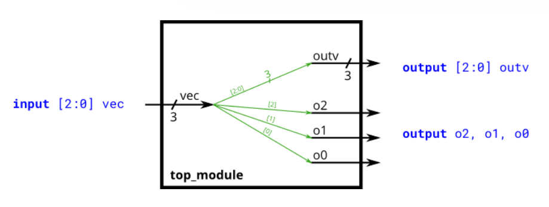
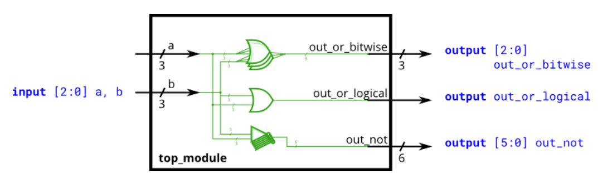
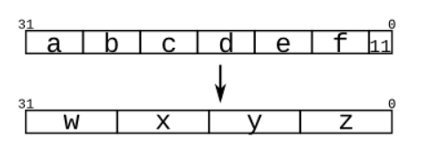
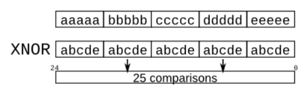

# Verilog Language -> Vectors

## 11 Vectors
<details>
<summary>详情</summary>

构建一个具有一个 3 位输入的电路，然后输出相同的向量，并将其拆分为三个单独的 1 位输出。
将输出 o0 连接到输入向量的位置 0，将 o1 连接到位置 1，依此类推。     

  

**分析**  
无。

**答案**  
```
module top_module ( 
    input wire [2:0] vec,
    output wire [2:0] outv,
    output wire o2,
    output wire o1,
    output wire o0  ); // Module body starts after module declaration
    assign outv = vec;
    assign o2 = vec[2];
    assign o1 = vec[1];
    assign o0 = vec[0];

endmodule
```

</details>

## 12 Vectors in more detail
<details>
<summary>详情</summary>

本段内容翻译参考[LogicJitterGibbs](https://zhuanlan.zhihu.com/p/57452966)  
向量用于使用一个名称对相关信号进行分组，以便于操作。例如，wire [7:0] w；声明一个名为 w 的 8 位向量，相当于有 8 条单独的连线。  

**向量声明**  

向量在声明时，必须遵循以下格式：  
`type [upper:lower] vector_name;`

**举一些例子**  
```
wire [7:0] w;         // 8-bit wire
reg  [4:1] x;         // 4-bit reg
output reg [0:0] y;   // 1-bit reg that is also an output port (this is still a vector)
input wire [3:-2] z;  // 6-bit wire input (negative ranges are allowed)
output [3:0] a;       // 4-bit output wire. Type is 'wire' unless specified otherwise.
wire [0:7] b;         // 8-bit wire where b[0] is the most-significant bit.
```
这里你需要了解一个向量的比特顺序（endianness）信息，比特顺序取决于向量的 LSB 是向量的高位还是地位。
比如声明为 [3:0] w 的向量，LSB 是 w[0]，如果声明为 [0:3] w,那么 w[3] 是 LSB 。LSB 指的是二进制数中权值最低的一位。

在 Verilog 语法中，你可以将向量声明为 [3:0], 这种语法最为常见，但也可以将向量声明为 [0:3] 。**这种命名方式博主并不推荐。**
这都是可以的，但必须在声明和使用时保持一致。如果声明为 wire [3:0] w ，但使用 w[0:3]赋值，这是不允许的。
保持前后如一的比特顺序是很重要的一点，一些你挠破头都定位不了的 BUG 可能就是字节顺序不一致导致的。

**变量隐式声明的危害**

变量的隐式声明是 Verilog 中 BUG 的一大来源。  
信号变量有两种声明方式，一是使用 wire 或者 assign 语句进行显示声明和定义，二是**综合器的隐式声明和定义**。  
当你将一个未定义声明的信号连接到模块的输入输出端口时，综合器会“热心”地帮助你声明这个信号。
但我可以向你保证，综合器没有厉害到能通过上下文，察言观色，“热心而正确”地帮你声明信号，
它只会**将其声明为 1 bit wire 型信号**，当你本来需要使用一个超过 1 bit 的向量，但又忘记声明时，综合器往往就好心办坏事了。

（当然综合器会在这个生成 Warning，所以查看下 Warning 是查找 BUG 的好办法）  
```
wire [2:0] a, c;   // Two vectors
assign a = 3'b101;  // a = 101
assign b = a;       // b =   1  implicitly-created wire
assign c = b;       // c = 001  <-- bug **来了 b 被 coder 默认为和 a 相同的 3'b101，但其实 b 只有 1bit宽**
my_module i1 (d,e); // d and e are implicitly one-bit wide if not declared.
                    // This could be a bug if the port was intended to be a vector.
```
添加 `default_nettype none 会使第二行代码出错，从而使错误更加明显。  
没有被规定的数据位宽，系统在综合的时候会默认设置成1位宽，这就导致了错误的产生。  

**unpacked vs. packed 数组**   

在声明向量时，一般向量的位宽写在向量名之前。位宽定义了向量的 packed 维度，该向量中每位信号都被视作一个块进行操作（在仿真中，硬件中有所不同）。
unpacked 维度定义在向量名之后，通常用来定义向量数组。  
```
reg [7:0] mem [255:0];   // 256 unpacked elements, each of which is a 8-bit packed vector of reg.
reg mem2 [28:0];         // 29 unpacked elements, each of which is a 1-bit reg.
```
这段感兴趣的朋友可以看看其他资料。  

**访问向量元素：切片**  

使用向量名称访问整个向量。例如：`assign w = a;`  
- 在 assign 赋值操作中，如果等号左右两侧信号的位宽不同，那么就会进行截断或者补零操作。
- 左侧信号位宽大于右侧信号位宽，右值的低位赋予左值对应的低位，左值高位的部分赋零。
- 左侧信号位宽小于右侧信号位宽，右值的低位赋予左值对应的低位，右值高位的部分直接被截断。即保留右值的低位。

一些例子：
```
w[3:0]      // Only the lower 4 bits of w
x[1]        // The lowest bit of x
x[1:1]      // ...also the lowest bit of x
z[-1:-2]    // Z 最低两位
b[3:0]      // 如果 b 在声明时 声明为 wire [0:3] b;则不能使用 b [3:0]进行选择
b[0:3]      // b的高四位.
assign w[3:0] = b[0:3];    // 将 b 的高位赋予 w 的低位 w[3]=b[0], w[2]=b[1], etc.
```

**练一练**   
构建一个组合电路，将输入半字（16 位， [15:0] ）拆分为低 [7:0] 和高 [15:8] 字节。

**分析**  
无。

**答案**  
```
`default_nettype none     // Disable implicit nets. Reduces some types of bugs.
module top_module( 
    input wire [15:0] in,
    output wire [7:0] out_hi,
    output wire [7:0] out_lo );
    assign out_hi = in[15:8];
    assign out_lo = in[7:0];
endmodule
```

</details>

## 13 Vector part select
<details>
<summary>详情</summary>

一个 32 位向量可以被视为包含 4 个字节（位 [31:24]、[23:16] 等）。构建一个将反转 4 字节字的字节顺序的电路。  
` AaaaaaaaBbbbbbbbCcccccccDddddddd => DdddddddCcccccccBbbbbbbbAaaaaaaa `

**分析**  
无。

**答案**  
```
module top_module( 
    input [31:0] in,
    output [31:0] out );
    assign out = {in[7:0],in[15:8],in[23:16],in[31:24]};
endmodule
```

</details>

## 14 Bitwise operators
<details>
<summary>详情</summary>

构建一个具有两个 3 位输入的电路，用于计算两个向量的`按位或`、两个向量的`逻辑或`以及两个向量的`逆 (NOT)`。
将 b 的倒数放在 out_not 的上半部分（即位 [5:3]），将 a 的倒数放在下半部分。  

**按位与逻辑运算符**  
- 按位运算符：对于 N 比特输入向量之间的逻辑比较，会在 N 比特上`逐位`进行，并产生一个` N 比特长`的运算结果。
- 逻辑运算符：`任何类型的输入都会被视作布尔值`，零->假，非零->真，将布尔值进行逻辑比较后，输出一个` 1 比特`的结果。

根据以下电路，描述出对应verilog。  
   

**分析**  
`| 和 ||`。  
`& 和 &&`。  
`^ 和 ^^`。  

**答案**  
```
module top_module( 
    input [2:0] a,
    input [2:0] b,
    output [2:0] out_or_bitwise,
    output out_or_logical,
    output [5:0] out_not
);
    assign out_or_bitwise = a | b;
    assign out_or_logical = a || b;
    assign out_not = {~b,~a};

endmodule
```

</details>

## 15 Four-input gates
<details>
<summary>详情</summary>

构建一个具有四个输入的组合电路，in[3:0]。  
有3个输出：  
- out_and：4 输入`AND`的输出。
- out_or：4 输入`OR`的输出。
- out_xor：4 输入`XOR`的输出。  

**分析**  
分别为`与门`、`或门`、`异或门`。  

**答案**  
```
module top_module( 
    input [3:0] in,
    output out_and,
    output out_or,
    output out_xor
);
    assign out_and = &in;
    assign out_or = |in;
    assign out_xor = ^in;

endmodule
```

</details>

## 16 Vector concatenation operator
<details>
<summary>详情</summary>

连接运算符 {a,b,c} 用于通过将向量的较小部分连接在一起来创建更大的向量。  

**举个栗子：**  
```
{3'b111, 3'b000} => 6'b111000
{1'b1, 1'b0, 3'b101} => 5'b10101
{4'ha, 4'd10} => 8'b10101010     // 4'ha and 4'd10 are both 4'b1010 in binary
```
连接运算符中的向量`务必需要标注位宽`，不然综合器怎么能知道你的结果需要多宽的位宽。
因此 { 1,2,3 } 这样的操作是非法的，并会产生一个 Error：unsized constants are not allowed in concatenations.  

连接运算符可用于赋值的左侧和右侧。  
```
input [15:0] in;
output [23:0] out;
assign {out[7:0], out[15:8]} = in;         // Swap two bytes. Right side and left side are both 16-bit vectors.
assign out[15:0] = {in[7:0], in[15:8]};    // This is the same thing.
assign out = {in[7:0], in[15:8]};       // This is different. The 16-bit vector on the right is extended to
                                        // match the 24-bit vector on the left, so out[23:16] are zero.
                                        // In the first two examples, out[23:16] are not assigned.
```

**练一练**  
给定几个输入向量，将它们连接在一起，然后将它们分成几个输出向量。
有六个 5 位输入向量：a、b、c、d、e 和 f，总共 30 位输入。有四个 8 位输出向量：w、x、y 和 z，用于 32 位输出。
输出应该是输入向量的串联，后跟两个 1 位：  

  

**分析**  
无。

**答案**  
```
module top_module (
    input [4:0] a, b, c, d, e, f,
    output [7:0] w, x, y, z );//

    assign {w, x, y, z} = {a, b, c, d, e, f, 2'b11};

endmodule
```

</details>

## 17 Vector reversal 1
<details>
<summary>详情</summary>

给定一个 8 位输入向量 [7:0]，反转其位顺序。  

**分析**  
循环语句。

**答案**  
```
module top_module( 
    input [7:0] in,
    output [7:0] out
);
    integer i;
    always @(*)
        for (i = 0; i < 8; i = i + 1)
            out[i] = in[7 - i];

endmodule
```

</details>

## 18 Replication operator
<details>
<summary>详情</summary>

连接运算符允许将向量连接在一起以形成更大的向量。
但有时您希望将同一事物多次连接在一起，并且执行诸如 assign a = {b,b,b,b,b,b}; 之类的操作仍然很乏味。
复制运算符允许重复一个向量并将它们连接在一起：  
`{num{vector}}`  

**一些栗子**  
```
{5{1'b1}}           // 5'b11111 (or 5'd31 or 5'h1f)
{2{a,b,c}}          // The same as {a,b,c,a,b,c}
{3'd5, {2{3'd6}}}   // 9'b101_110_110. It's a concatenation of 101 with
                    // the second vector, which is two copies of 3'b110.
```

**notes**  
`{}不能少`  

**练一练**  
看到复制运算符的一个常见地方是，将较小的数字符号扩展为较大的数字，同时保留其符号值。
这是通过将`较小数字的符号位（最高有效位）`复制到`左侧`来完成的。
例如，将` 4'b0101 (5) `符号扩展至 8 位会产生` 8'b00000101 (5)`，
而将` 4'b1101 (-3) `符号扩展至 8 位会产生` 8'b11111101 (-3)`。  

构建一个将 8 位数字符号扩展为 32 位的电路。这需要连接 24 个符号位副本（即复制 bit[7] 24 次），然后是 8 位数字本身。

**分析**  
无。

**答案**  
```
module top_module (
    input [7:0] in,
    output [31:0] out );//
    
    assign out = {{24{in[7]}},in};

endmodule
```

</details>

## 19 More replication
<details>
<summary>详情</summary>

给定五个 1 位信号（a、b、c、d 和 e），计算 25 位输出向量中的所有 25 个成对的一位比较。如果被比较的两位相等，则输出应为 1。  

具体解释为：  
```
out[24] = ~a ^ a;   // a == a, so out[24] is always 1.
out[23] = ~a ^ b;
out[22] = ~a ^ c;
...
out[ 1] = ~e ^ d;
out[ 0] = ~e ^ e;
```

  

**分析**  
如图所示，使用复制和连接运算符可以更轻松地完成此操作。
- 顶部向量是每个输入的 5 次重复的串联。
- 底部向量是 5 个输入的串联的 5 次重复。  
注意一下运算符号优先级的问题。  

**答案**  
```
module top_module (
    input a, b, c, d, e,
    output [24:0] out );//
    
    wire [24:0] a1,a2;
    assign a1 = {{5{a}},{5{b}},{5{c}},{5{d}},{5{e}}};
    assign a2 = {5{a,b,c,d,e}};
    assign out = ~a1 ^ a2;

endmodule
```

</details>
