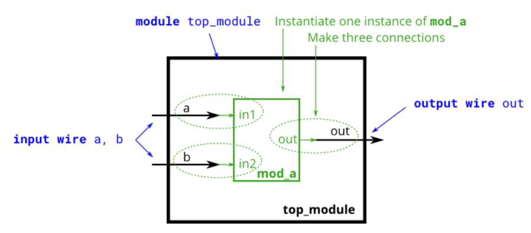
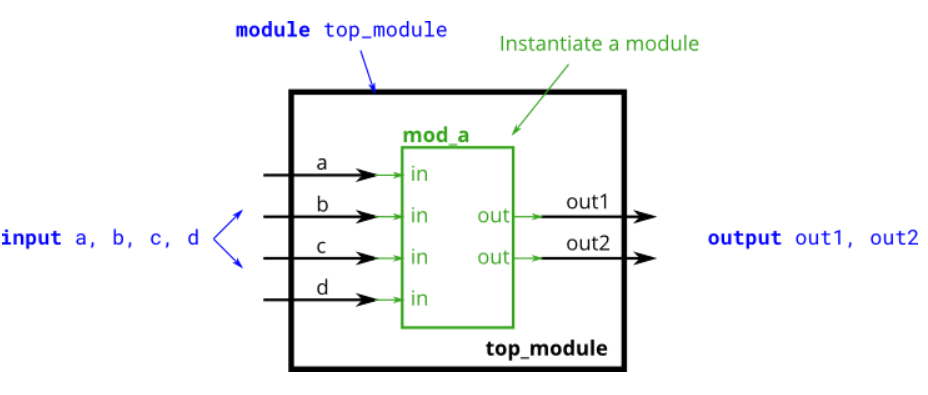
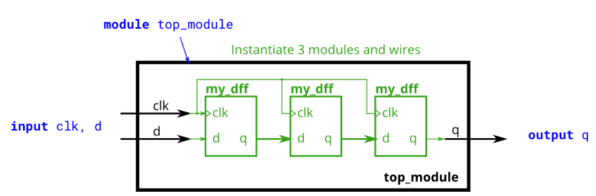
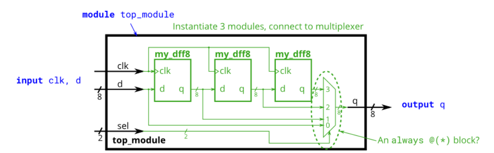
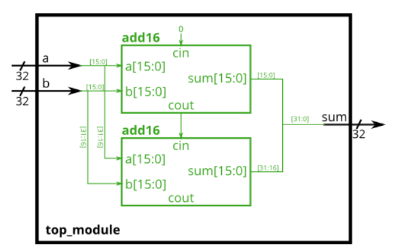
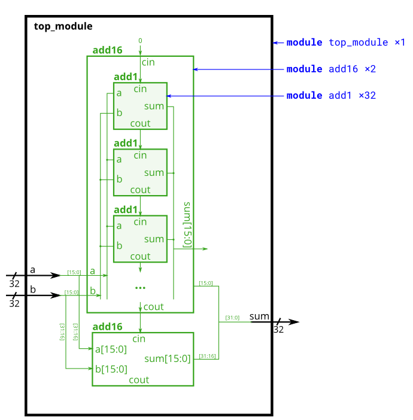
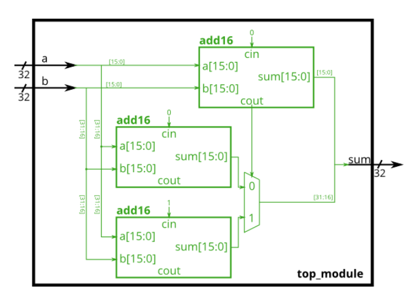
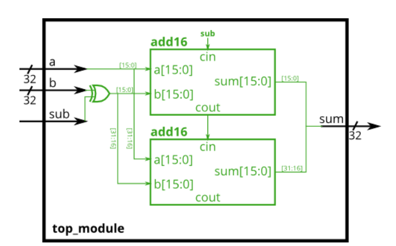

# Verilog Language -> Modules - Hierarchy

## 20 Modules
<details>
<summary>详情</summary>

到目前为止，您已经熟悉了一个模块，它是一个通过输入和输出端口与其外部交互的电路。
更大、更复杂的电路是通过将更大的模块从更小的模块和连接在一起的其他部分（例如 `assign` 语句和 `always` 块）组成的来构建的。
这形成了一个层次结构，因为模块可以包含其他模块的实例。  
下图显示了一个带有子模块的非常简单的电路。
在本练习中，创建模块 mod_a 的一个实例，然后将模块的三个引脚（in1、in2 和 out）连接到顶层模块的三个端口（线 a、b 和 out）。
模块 mod_a 是为您提供的——您必须实例化它。  

连接模块时，只有模块上的端口很重要。您不需要知道模块内的代码。模块 mod_a 的代码如下所示：
```
module mod_a ( input in1, input in2, output out );
    // Module body
endmodule
```

模块的层次结构是通过在另一个模块中实例化一个模块来创建的，只要使用的所有模块都属于同一个项目（因此编译器知道在哪里可以找到该模块）。
一个模块的代码没有写在另一个模块的主体中（不同模块的代码没有嵌套）。  
您可以通过端口名称或端口位置将信号连接到模块。如需额外练习，请尝试两种方法。  

  

**分析**  
模块信号连接的两种方式
- 按端口顺序，mod_a instance1 ( wa, wb, wc ); wa, wb, wc 分别连接到模块的 第一个端口（in1），第二个端口（in2）以及第三个端口（out）。这里所谓的端口顺序指的是模块端口的定义顺序。这种方式的弊端在于，一旦端口列表发生改变，所有模块实例化中的端口连接都需要改变。
- 按端口名称，mod_a instance2 ( .out(wc), .in1(wa), .in2(wb) ); 在这种方式中根据端口名称指定外部信号的连接。这样一来就和端口声明的顺序完全没有关系。一旦模块出现改动，只要修改相应的部分即可。实际上，一般都使用这种方式来进行模块实例化。。

**答案**  
```
module top_module ( input a, input b, output out );
    mod_a u_mod_a(
        .in1(a),
        .in2(b),
        .out(out)
    );

endmodule
```

</details>

## 21 Connecting ports by position
<details>
<summary>详情</summary>

与20类似。您将获得一个名为 mod_a 的模块，该模块按顺序具有 2 个输出和 4 个输入。
您必须按位置将 6 个端口按顺序连接到顶层模块的端口 out1、out2、a、b、c 和 d。  

您将获得以下模块：  
`module mod_a ( output, output, input, input, input, input );`  



**分析**  
按端口顺序命名。

**答案**  
```
module top_module ( 
    input a, 
    input b, 
    input c,
    input d,
    output out1,
    output out2
);
    mod_a mod_a_0 (out1, out2, a, b, c, d);
endmodule
```

</details>

## 22 Connecting ports by name
<details>
<summary>详情</summary>

与20。您将获得一个名为 mod_a 的模块，该模块按某种顺序具有 2 个输出和 4 个输入。您必须按名称将 6 个端口连接到顶级模块的端口：  
```
Port in mod_a	Port in     top_module
output          out1	    out1
output          out2	    out2
input           in1	        a
input           in2	        b
input           in3	        c
input           in4	        d
```

您将获得以下模块：  
`module mod_a ( output out1, output out2, input in1, input in2, input in3, input in4);`  

  

**分析**  
按端口名称命名。

**答案**  
```
module top_module ( 
    input a, 
    input b, 
    input c,
    input d,
    output out1,
    output out2
);
    mod_a u_mod_a ( 
        .in1(a), 
        .in2(b), 
        .in3(c),
        .in4(d),
        .out1( out1),
        .out2( out2)
);

endmodule
```

</details>

## 23 Three modules
<details>
<summary>详情</summary>

将获得一个带有两个输入和一个输出的模块 my_dff（实现 D 触发器）。
将其中三个实例化，然后将它们链接在一起以制成长度为 3 的移位寄存器。 clk 端口需要连接到所有实例。  

提供给你的模块是：`module my_dff(input clk, input d, output q);`  

请注意，要建立内部连接，您需要声明一些连线。命名你的连线和模块实例时要小心：`名称必须是唯一的`。。

   

**分析**  
module之间的信号线用 `wire` 命名。 

**答案**  
```
module top_module ( input clk, input d, output q );
    
    wire q0,q1,q2;
    my_dff my_dff_0 (
        .clk(clk), 
        .d(d), 
        .q(q0)
    );
    
    my_dff my_dff_1 (
        .clk(clk), 
        .d(q0), 
        .q(q1)
    );
    
    my_dff my_dff_2 (
        .clk(clk), 
        .d(q1), 
        .q(q)
    );

endmodule
```

</details>

## 24 Modules and vectors
<details>
<summary>详情</summary>

您将获得一个带有 2 个输入和 1 个输出的模块 `my_dff8`（实现一组 8 个 D 触发器）。
实例化其中的三个，然后将它们链接在一起以形成一个长度为 3 的 8 位宽移位寄存器。
此外，创建一个` 4 对 1 多路复用器`（未提供），它根据 sel[1:0] 选择输出什么：输入 d 处的值，在第一个、第二个或第三个 D 触发器之后。
（本质上，sel 选择延迟输入的周期数，从零到三个时钟周期。）  

提供给你的模块是：`module my_dff8(input clk, input [7:0] d, output [7:0] q);`  

   

**分析**  
无。  

**答案**  
```
module top_module ( 
    input clk, 
    input [7:0] d, 
    input [1:0] sel, 
    output [7:0] q 
);
    wire [7:0] q0,q1,q2;
    my_dff8 my_dff8_0 (
        .clk(clk), 
        .d(d), 
        .q(q0)
    );
    
    my_dff8 my_dff8_1 (
        .clk(clk), 
        .d(q0), 
        .q(q1)
    );
    
    my_dff8 my_dff8_2 (
        .clk(clk), 
        .d(q1), 
        .q(q2)
    );
    
    always @(*) begin 
        case(sel)
            3'b00: q = d;
            3'b01: q = q0;
            3'b10: q = q1;
            3'b11: q = q2;
        endcase
    end

endmodule
```

</details>

## 25 Adder 1
<details>
<summary>详情</summary>

您将获得一个执行 16 位加法的模块 add16。 实例化其中两个以创建一个 32 位加法器。
一个 add16 模块计算加法结果的低 16 位，而第二个 add16 模块在接收到第一个加法器的进位后计算结果的高 16 位。
您的 32 位加法器不需要处理进位（假设为 0）或进位（忽略），但内部模块需要才能正常工作。 
（换句话说，add16 模块执行 16 位 a + b + cin，而您的模块执行 32 位 a + b）。  

如下图所示将模块连接在一起。提供的模块 add16 具有以下声明：  
`module add16 ( input[15:0] a, input[15:0] b, input cin, output[15:0] sum, output cout );`  



**分析**  
看图说话。  

**答案**  
```
module top_module(
    input [31:0] a,
    input [31:0] b,
    output [31:0] sum
);
    
    wire cout;
    add16 u1_add16(
        .a(a[15:0]		),
        .b(b[15:0]		),
        .cin(1'b0		),
        .sum(sum[15:0]	),
        .cout(cout		)
    );
    
    add16 u2_add16(
        .a(a[31:16]		),
        .b(b[31:16]		),
        .cin(cout		),
        .sum(sum[31:16]	),
        .cout(			)
    );
    
endmodule
```

</details>

## 26 Adder 2
<details>
<summary>详情</summary>

在本练习中，您将创建具有两个层次结构的电路。
您的 top_module 将实例化 add16 的两个副本（已提供），每个副本将实例化 add1 的 16 个副本（您必须编写）。
因此，您必须编写两个模块：top_module 和 add1。  

与 module_add 一样，您将获得一个执行 16 位加法的模块 add16。您必须实例化其中的两个以创建 32 位加法器。
一个 add16 模块计算加法结果的低 16 位，而第二个 add16 模块计算结果的高 16 位。
您的 32 位加法器不需要处理进位（假设为 0）或进位（忽略）。  

如下图所示将 add16 模块连接在一起。提供的模块 add16 具有以下声明：  
`module add16 ( input[15:0] a, input[15:0] b, input cin, output[15:0] sum, output cout );`  

在每个 add16 中，实例化了 16 个全加器（`模块 add1，未提供`）以实际执行加法。您必须编写具有以下声明的完整加法器模块：  
`module add1 ( input a, input b, input cin, output sum, output cout );`  

  

**分析**  
本设计共有三个模块：  
- top_module — 您的顶级模块，其中包含两个...
- add16, provided — 一个 16 位加法器模块，由 16 个...
- add1 — 1 位全加器模块。  

1 bit 全加器是有标准的写法： 
```
sum = a ^ b ^ cin;
cout = a&b | a&cin | b&cin;
```  

博主这么偷懒了，1 bit 全加器所得结果不是一位就是两位： 
`assign {cout,sum} = a + b + cin;`  

**答案**  
```
module top_module (
    input [31:0] a,
    input [31:0] b,
    output [31:0] sum
);//
    wire cout;
    add16 u1_add16(
        .a(a[15:0]		),
        .b(b[15:0]		),
        .cin(1'b0		),
        .sum(sum[15:0]	),
        .cout(cout		)
    );
    
    add16 u2_add16(
        .a(a[31:16]		),
        .b(b[31:16]		),
        .cin(cout		),
        .sum(sum[31:16]	),
        .cout(			)
    );

endmodule

module add1 ( input a, input b, input cin,   output sum, output cout );

    assign {cout,sum} = a + b + cin;

endmodule
```

</details>

## 27 Carry-select adder
<details>
<summary>详情</summary>

在本练习中，为您提供与前一练习相同的模块 add16，它将两个 16 位数字与进位相加，并产生一个进位和 16 位和。
您必须使用您自己的 16 位 2 对 1 多路复用器来实例化其中的三个以构建进位选择加法器。  

如下图所示将模块连接在一起。提供的模块 add16 具有以下声明：  
`module add16 ( input[15:0] a, input[15:0] b, input cin, output[15:0] sum, output cout );`  



**分析**  
看图说话。

**答案**  
```
module top_module(
    input [31:0] a,
    input [31:0] b,
    output [31:0] sum
);
    wire sel;
    wire [15:0] ad16,ad16_no;
    add16 u1_add16(
        .a(a[15:0]		),
        .b(b[15:0]		),
        .cin(1'b0		),
        .sum(sum[15:0]	),
        .cout(sel		)
    );
    
    add16 u2_add16(
        .a(a[31:16]		),
        .b(b[31:16]		),
        .cin(1'b0		),
        .sum(ad16_no	),
        .cout(			)
    );
    
    add16 u3_add16(
        .a(a[31:16]		),
        .b(b[31:16]		),
        .cin(1'b1		),
        .sum(ad16		),
        .cout(			)
    );
    
    
    always @(*) begin
        case(sel)
            1'b0: sum[31:16] <= ad16_no;
            1'b1: sum[31:16] <= ad16;
        endcase
    end

endmodule
```

</details>

## 28 Adder-subtractor
<details>
<summary>详情</summary>

构建下面的加减法器。  
为您提供了一个 16 位加法器模块，您需要对其进行两次实例化：  
`module add16 ( input[15:0] a, input[15:0] b, input cin, output[15:0] sum, output cout );`  

每当 sub 为 1 时，使用 32 位宽的 XOR 门来反转 b 输入。（这也可以被视为 b[31:0] 与 sub 复制 32 次进行异或。）。还将子输入连接到加法器的进位。



**分析**  
减法的本质还是加法。  
冷知识：减去一个数等于加上这个数的补码。  
```
加法器-减法器可以通过选择性地取反一个输入来从加法器构建，这相当于将输入反相然后加 1。
最终结果是一个可以执行两种操作的电路：(a + b + 0) 和 ( a + ~b + 1)。
```

**答案**  
```
module top_module(
    input [31:0] a,
    input [31:0] b,
    input sub,
    output [31:0] sum
);
    wire [31:0] b_h;
    assign b_h = {32{sub}} ^ b;
    wire cout;
    add16 u1_add16(
        .a(a[15:0]		),
        .b(b_h[15:0]		),
        .cin(sub		),
        .sum(sum[15:0]	),
        .cout(cout		)
    );
    
    add16 u2_add16(
        .a(a[31:16]		),
        .b(b_h[31:16]		),
        .cin(cout		),
        .sum(sum[31:16]	),
        .cout(			)
    );

endmodule
```

</details>

