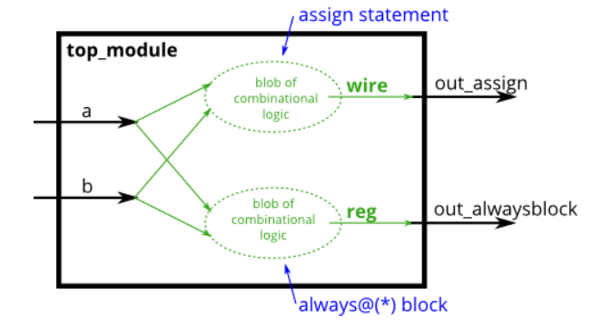
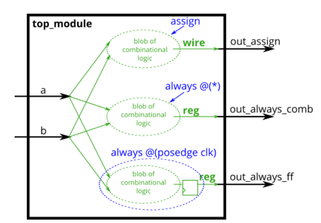
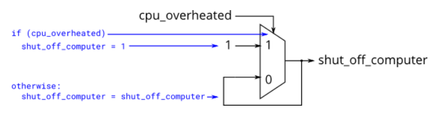

# Verilog Language -> Procedures

## 29 Always blocks - combinational
<details>
<summary>详情</summary>

由于数字电路是由用导线连接的逻辑门组成的，因此任何电路都可以表示为`module`和`assign`语句的某种组合。
然而，有时这并不是描述电路的最方便的方式。过程块（比如`always块`）提供了一种用于替代`assign`语句描述电路的方法。  

对于综合硬件，提供了两种类型的 always 块：  
- 组合逻辑：always @(*)
- 时序逻辑：always @(posedge clk)  

组合always块相当于assign语句，因此组合电路存在两种表达方法。
具体使用哪个主要取决于使用哪个更方便。`过程块内的代码与外部的assign代码不同`。
过程块中可以使用更丰富的语句(比如if-then,case)，`但不能包含连续赋值*`。
但也引入了一些非直观的错误。(*过程连续赋值确实可以存在，但与连续赋值有些不同，并且不可综合)  

例如，assign和组合always块描述相同的电路。两者均创造出了相同的组合逻辑电路。只要任何输入(右侧)改变值，两者都将重新计算输出。  
```
assign out1 = a & b | c ^ d;
always @(*) out2 = a & b | c ^ d;
```

对于组合always块，敏感变量列表总是使用(*)。
如果把所有的输入都列出来也是可以的，但容易出错的(可能少列出了一个)，并且在硬件综合时会忽略您少列了一个，仍按原电路综合。
但仿真器将会按少列一个来仿真，这导致了仿真与硬件不匹配。(在SystemVerilog中，使用always_comb)  

  

**练一练**  
使用 assign 语句和组合 always 块构建 AND 门。（由于分配语句和组合总是相同的块功能，没有办法强制你使用这两种方法。但你是来练习的，对吧？...）/狗头  

**答案**  
```
module top_module(
    input a, 
    input b,
    output wire out_assign,
    output reg out_alwaysblock
);
    assign out_assign = a & b;
	always @(*) out_alwaysblock = a & b;

endmodule
```

</details>

## 30 Always blocks - clocked
<details>
<summary>详情</summary>

对于综合硬件，提供了两种类型的 always 块：  
- 组合逻辑：always @(*)
- 时序逻辑：always @(posedge clk)   

时序always块像组合always块一样创建一个组合逻辑块，但也在组合逻辑块的输出处创建一组触发器（或“寄存器”）。
`不是立即可见逻辑块的输出`，而是仅在`下一个（posedge clk）`之后立即可见输出。  

**阻塞赋值与非阻塞赋值**  

Verilog 中有三种类型的赋值：  
- 连续赋值（assign x = y;）。不能在过程块使用。
- 过程阻塞赋值：(x = y;)。只能在过程块中使用。
- 过程非阻塞赋值：(x <= y;)。只能在过程块使用。

总的来说，在组合always块中，使用阻塞性赋值。在时序always块中，使用非阻塞性赋值。  

以三种方式构建异或门，使用assign语句、组合always块和时序always块。请注意，时钟always块产生的电路与其他两个不同，有一个触发器，因此输出被延迟。  

  

**分析**  
无。  

**答案**  
```
module top_module(
    input clk,
    input a,
    input b,
    output wire out_assign,
    output reg out_always_comb,
    output reg out_always_ff   );
    
    assign out_assign = a ^ b;
    always @(*) out_always_comb = a ^ b;
    always @(posedge clk) out_always_ff = a ^ b;

endmodule
```

</details>

## 31 If statement
<details>
<summary>详情</summary>

if 语句通常创建一个 2 对 1 多路复用器，如果条件为真则选择一个输入，如果条件为假则选择另一个输入。  

示例：  
```
always @(*) begin
    if (condition) begin
        out = x;
    end
    else begin
        out = y;
    end
end
```

等价于：  
`assign out = (condition) ? x : y;`  

构建一个在 a 和 b 之间进行选择的 2 对 1 多路复用器。
如果 sel_b1 和 sel_b2 都为真，则选择 b。否则，选择a。
同样的事情做两次，一次使用分配语句，一次使用 if 语句。  

**分析**  
无。

**答案**  
```
module top_module(
    input a,
    input b,
    input sel_b1,
    input sel_b2,
    output wire out_assign,
    output reg out_always   ); 
    
    wire [1:0] sel;
    assign sel = {sel_b1,sel_b2};
    always @(*) begin
        case(sel)
            2'b11: out_always = b;
            default: out_always = a;
        endcase
    end
    assign out_assign = (sel_b1 & sel_b2) ? b : a;

endmodule
```

</details>

## 32 If statement latches
<details>
<summary>详情</summary>

**常见的错误来源：如何避免引入锁存器**  

设计电路时，首先要从电路方面考虑：
- 我想要这个逻辑门
- 我想要一个具有这些输入并产生这些输出的组合逻辑块
- 我想要一个组合的逻辑块，然后是一组触发器  

`你不能做的是先写代码，然后希望它生成一个合适的电路。`  
- If (cpu_overheated) then shut_off_computer = 1;
- If (~arrived) then keep_driving = ~gas_tank_empty;

语法正确的代码不一定会产生合理的电路（组合逻辑 + 触发器）。通常的原因是：“在您指定的情况以外的情况下会发生什么？”。 Verilog 的回答是：`保持输出不变`。  

这种“保持输出不变”的行为意味着需要记住当前状态，从而产生一个锁存器。
组合逻辑（例如逻辑门）不能记住任何状态。注意`Warning (10240): ... inferring latch(es)`消息。
除非锁存器是故意的，否则它几乎总是表示错误。组合电路必须在所有条件下为所有输出分配一个值。
这通常意味着您总是需要 else 子句或分配给输出的默认值。  

以下代码包含`生成锁存器的错误`。修复错误，以便您仅在计算机确实过热时关闭计算机，并在您到达目的地或需要加油时停止驾驶。  

  

```
always @(*) begin
    if (cpu_overheated)
       shut_off_computer = 1;
end

always @(*) begin
    if (~arrived)
       keep_driving = ~gas_tank_empty;
end
```

**分析**  
if...else...尽量把条件判断补充完整。

**答案**  
```
module top_module (
    input      cpu_overheated,
    output reg shut_off_computer,
    input      arrived,
    input      gas_tank_empty,
    output reg keep_driving  ); //

    always @(*) begin
        if (cpu_overheated)
           shut_off_computer = 1;
        else
            shut_off_computer = 0;
    end

    always @(*) begin
        if (~arrived)
           keep_driving = ~gas_tank_empty;
        else
           keep_driving = 0;
    end

endmodule
```

</details>

## 33 Case statement
<details>
<summary>详情</summary>

Verilog 中的 case 语句几乎等同于将一个表达式与其他表达式进行比较的 if-elseif-else 序列。
它的语法和功能不同于 C 中的 switch 语句。  

示例：  
```
always @(*) begin     // This is a combinational circuit
    case (in)
      1'b1: begin 
               out = 1'b1;  // begin-end if >1 statement
            end
      1'b0: out = 1'b0;
      default: out = 1'bx;
    endcase
end
```

- case 语句以 case 开头，每个case项以冒号结尾。switch语句没有。
- 每个case案例项只能执行`一个语句`。这使得 C 中使用的“中断”变得不必要。但这意味着，如果您需要`多个语句`，则必须使用 `begin ... end`。
- case允许重复（和部分重叠）案例项目。使用第一个匹配的。 C 不允许重复的案例项目。

创建一个 6 对 1 多路复用器。当 sel 在 0 到 5 之间时，选择对应的数据输入。否则，输出 0。数据输入和输出均为 4 位宽。  

**不要锁存器！！**  

**分析**  
注意case的完整性。 

**答案**  
```
module top_module ( 
    input [2:0] sel, 
    input [3:0] data0,
    input [3:0] data1,
    input [3:0] data2,
    input [3:0] data3,
    input [3:0] data4,
    input [3:0] data5,
    output reg [3:0] out   );//

    always@(*) begin  // This is a combinational circuit
        case(sel)
            3'b000: out = data0;
            3'b001: out = data1;
            3'b010: out = data2;
            3'b011: out = data3;
            3'b100: out = data4;
            3'b101: out = data5;
            default: out = 3'b0;
        endcase
    end

endmodule
```

</details>

## 34 Priority encoder
<details>
<summary>详情</summary>

优先级编码器是一种组合电路，当给定输入位向量时，输出向量中第一个 1 位的位置。
例如，给定输入 8'b10010000 的 8 位优先级编码器将输出 3'd4，因为 bit[4] 是右数第一个高位。  

构建一个 4 位优先级编码器。对于这个问题，如果没有输入位为高（即输入为零），则输出零。请注意，一个 4 位数字有 16 种可能的组合。  

**分析**  
比较笨一点，可以选择把所有情况都列出来。  
可以使用不确定case条件，casez或者casex。  
以博主的理解，casex中的x在判断的时候并不考虑实际输入的值。比如说，`4'bxxx1`。
若bit[0]确实为1，则进入该条件下。当触发若干符合case时，仅进入第一个case。  

**答案**  
```
module top_module (
    input [3:0] in,
    output reg [1:0] pos  );
    
    always @(*) begin
        casex (in[3:0])
            4'bxxx1: pos = 0;   // in[3:1] can be anything
            4'bxx1x: pos = 1;
            4'bx1xx: pos = 2;
            4'b1xxx: pos = 3;
            default: pos = 0;
        endcase
    end

endmodule
```

</details>

## 35 Priority encoder with casez
<details>
<summary>详情</summary>

为 8 位输入构建优先级编码器。给定一个 8 位向量，输出应报告向量中的第一位为 1。
如果输入向量没有高位，则报告零。例如，输入 8'b10010000 应该输出 3'd4，因为 bit[4] 是第一个高位。  

**分析**  
casez和casex类似。  

**答案**  
```
module top_module (
    input [7:0] in,
    output reg [2:0] pos  );
    always @(*) begin 
        casez(in)
            8'bzzzzzzzz1: pos = 0;
            8'bzzzzzzz1z: pos = 1;
            8'bzzzzzz1zz: pos = 2;
            8'bzzzzz1zzz: pos = 3;
            8'bzzzz1zzzz: pos = 4;
            8'bzz1zzzzzz: pos = 5;
            8'bz1zzzzzzz: pos = 6;
            8'b1zzzzzzzz: pos = 7;
            default: pos = 0;
        endcase
    end 

endmodule
```

</details>

## 36 Avoiding latches
<details>
<summary>详情</summary>

假设您正在构建一个电路来处理来自游戏的 PS/2 键盘的扫描码。
鉴于收到的扫描码的最后两个字节，您需要指出是否已按下键盘上的箭头键之一。
这涉及到一个相当简单的映射，它可以实现为具有四个case的case语句（或 if-elseif）。  
```
Scancode [15:0]	    Arrow key
16'he06b	        left arrow
16'he072	        down arrow
16'he074	        right arrow
16'he075	        up arrow
Anything else	    none
```

您的电路有一个 16 位输入和四个输出。构建识别这四个扫描码并断言正确输出的电路。  

为避免创建锁存器，必须在所有可能的条件下为所有输出分配一个值。仅仅有一个默认情况是不够的。
您必须为所有四种情况和默认情况下的所有四个输出分配一个值。这可能涉及大量不必要的输入。
解决此问题的一种简单方法是在 case 语句之前为输出分配一个“默认值”：  
```
always @(*) begin
    up = 1'b0; down = 1'b0; left = 1'b0; right = 1'b0;
    case (scancode)
        ... // Set to 1 as necessary.
    endcase
end
```

**分析**  
代码冗余，提前建立变量。 

**答案**  
```
module top_module (
    input [15:0] scancode,
    output reg left,
    output reg down,
    output reg right,
    output reg up  ); 

    always @(*) begin
        up = 1'b0; down = 1'b0; left = 1'b0; right = 1'b0;
        case (scancode)
            16'he06b: left = 1'b1;
            16'he072: down = 1'b1;
            16'he074: right = 1'b1;
            16'he075: up = 1'b1;
 
        endcase
end

endmodule
```

</details>

