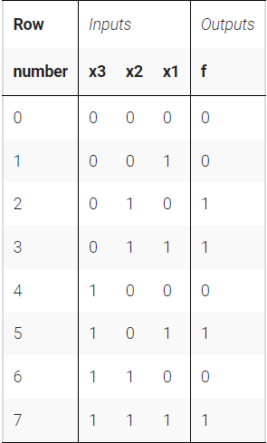
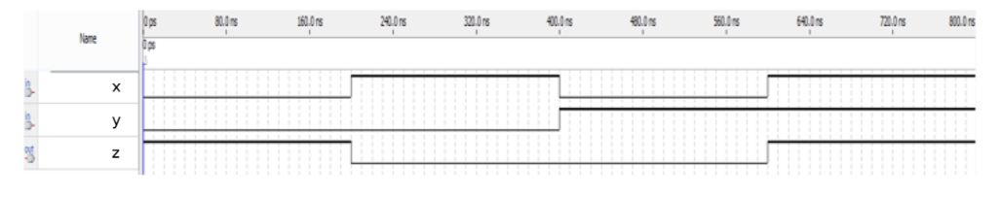
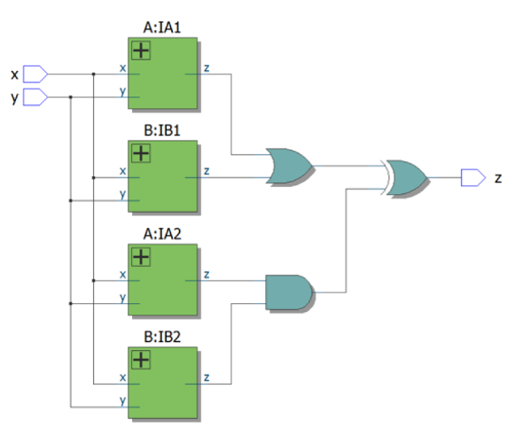
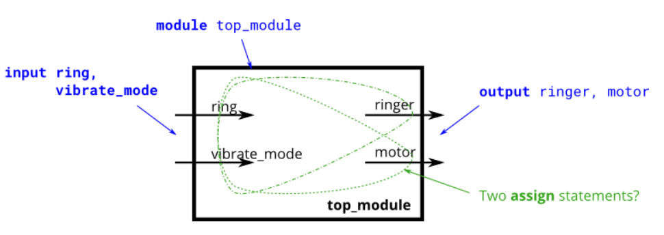

# Circuits -> Combinational Logic -> Basic Gates

## 44-50 鸽子
<details>
<summary>详情</summary>

没啥好说的...写就完事了...

</details>

## 51 Truth tables
<details>
<summary>详情</summary>

在前面的练习中，我们使用了简单的逻辑门和几个逻辑门的组合。这些电路是组合电路的示例。
组合意味着电路的输出只是其输入的函数（在数学意义上）。这意味着对于任何给定的输入值，只有一个可能的输出值。
因此，描述组合函数行为的一种方法是明确列出输入的每个可能值的输出应该是什么。  
对于 N 个输入的布尔函数，有 2N 种可能的输入组合。真值表的每一行列出一个输入组合，所以总是有 2N 行。输出列显示每个输入值的输出应该是什么。  

  

**从真值表合成电路**  
我这里就不翻译了。感觉原文的意思更贴近一些。  
One simple method to create a circuit that implements the truth table's function is to express the function in sum-of-products form. Sum (meaning OR) of products (meaning AND) means using one N-input AND gate per row of the truth table (to detect when the input matches each row), followed by an OR gate that chooses only those rows that result in a '1' output.  
For the above example, the output is '1' if the input matches row 2 or row 3 or row 5 or row 7 (This is a 4-input OR gate). The input matches row 2 if x3=0 and x2=1 and x1=0 (This is a 3-input AND gate). Thus, this truth table can be implemented in canonical form by using 4 AND gates that are ORed together.

创建上图真值表所示电路。  

**分析**  
卡诺图、真值表建议百度看看怎么化简。

**答案**  
```
module top_module( 
    input x3,
    input x2,
    input x1,  // three inputs
    output f   // one output
);
    assign f = x3 & x1 | x2 & x1 | ~x3 & x2;

endmodule
```

</details>

## 52 Two-bit equality
<details>
<summary>详情</summary>

创建一个具有两个 2 位输入 A[1:0] 和 B[1:0] 的电路，并产生一个输出 z。如果 A = B，z 的值应为 1，否则 z 应为 0。`  

**分析**  
无。

**答案**  
```
module top_module ( input [1:0] A, input [1:0] B, output z ); 
    
    assign z = A == B ? 1'b1 : 1'b0;

endmodule
```

</details>

## 53 Simple circuit A
<details>
<summary>详情</summary>

模块 A 应该实现函数 z = (x^y) & x。实现这个模块。  

**分析**  
无。

**答案**  
```
module top_module (input x, input y, output z);
    
    assign z = (x^y) & x;

endmodule
```

</details>

## 54 Simple circuit B
<details>
<summary>详情</summary>

电路B可以用下面的仿真波形来描述。  

   

**分析**  
波形图 -> 真值表 -> 电路图。 

**答案**  
```
module top_module ( input x, input y, output z );
    
    assign  z = ~(x ^ y);

endmodule
```

</details>

## 55 Combine circuits A and B
<details>
<summary>详情</summary>

根据53、54的模块写出如下电路图。  

   

**分析**  
看图说话。  

**答案**  
```
module top_module (input x, input y, output z);
    wire za;
    wire zb;
    
    assign za = (x ^ y) & x;
    assign zb = ~(x ^ y);
    assign z = (za | zb) ^ (za & zb);

endmodule
```

</details>

## 56 Ring or vibrate
<details>
<summary>详情</summary>

假设您正在设计一个电路来控制手机的振铃器和振动电机。
每当电话需要从来电中振铃（输入ring）时，您的电路必须打开振铃器（输出ringer = 1）或电机（输出motor = 1），但不能同时打开两者。
如果手机处于振动模式（输入 vibrate_mode = 1），打开电机。否则，打开铃声。  



**分析**  
输出由什么决定。  

**答案**  
```
module top_module (
    input ring,
    input vibrate_mode,
    output ringer,       // Make sound
    output motor         // Vibrate
);
    assign motor = ring ? (vibrate_mode ? 1'b1 : 1'b0) : 1'b0;
    assign ringer = ring ? (vibrate_mode ? 1'b0 : 1'b1) : 1'b0;

endmodule
```

</details>

## 57 Thermostat
<details>
<summary>详情</summary>

加热/冷却恒温器控制加热器（冬季）和空调（夏季）。实施一个可以根据需要打开和关闭加热器、空调和鼓风机的电路。  
恒温器可以处于两种模式之一：制热（mode = 1）和制冷（mode = 0）。
- 在制热模式下，当温度过低时（too_cold = 1），打开加热器，但不要使用空调。
- 在制冷模式下，当温度过高（too_hot = 1）打开空调，但不要打开加热器。

当加热器或空调打开时，也打开风扇使空气循环。此外，即使加热器和空调关闭，用户也可以请求将风扇打开（fan_on = 1）。  

**分析**  
应该是做烦了。。。  

**答案**  
```
module top_module (
    input too_cold,
    input too_hot,
    input mode,
    input fan_on,
    output heater,
    output aircon,
    output fan
); 
    // assign motor = mode ? (vibrate_mode ? 1'b1 : 1'b0) : 1'b0;
    always @(*) begin
        if (mode)begin
            if (too_cold) begin
                heater = 1'b1;
                aircon = 1'b0;
                // fan = 1'b1;
            end
            else begin
                heater = 1'b0;
                aircon = 1'b0;
                // fan = 1'b0;
            end
        end
        else begin
            if (too_hot) begin
                aircon = 1'b1;
                heater = 1'b0;
                // fan = 1'b1;
            end
            else begin
                heater = 1'b0;
                aircon = 1'b0;
                // fan = 1'b0;
            end
        end
    end
    
    always @(*) begin
        if (mode)begin
            if(too_cold | fan_on)
                fan = 1'b1;
            else
                fan = 1'b0;
        end
        else begin
            if(too_hot | fan_on)
                fan = 1'b1;
            else
                fan = 1'b0;
        end
    end

endmodule
```

</details>

## 58 3-bit population count
<details>
<summary>详情</summary>

设计一个电路来计算输入中 ‘ 1 ’ 个数。  

**分析**  
之前做过。。。  

**答案**  
```
module top_module( 
    input [2:0] in,
    output [1:0] out );
    
    int i;
    always @(*) begin
        out = 0;
        for(i = 0;i < 3;i = i + 1)
            if (in[i])
            	out = out + 1'b1;
    end

endmodule
```

</details>

## 59 Gates and vectors
<details>
<summary>详情</summary>

在 [3:0] 中给定一个四位输入向量。我们想知道每个位与其邻居之间的一些关系。  
- out_both: 输入的每一个bit均需要检测该bit位与其左侧（即高比特位）是否全为 ‘ 1 ’ 。示例： out_both[2]应检测in[2] 与 in[3] 是否均为 ‘ 1 ’ 。因为in[3] 为输入的最高位，故我们无需检测out_both[3]
- out_any: 输入的每一个bit均需要检测该bit位与其右侧（即低比特位）两者其中一个为 ‘ 1 ’ 。 示例： out_any[2]应检测in[2] 与 in[1] 两者其中一个为 ‘ 1 ’ 。因为in[0] 为输入的最低位，故我们无需检测out_any[0]
- out_different: 输入的每一个bit均需要检测该bit位与其左侧（即高比特位）两者是否不同。 示例： out_different[2]应检测in[2] 与 in[3] 两者是否不同 。在本节中，我们将输入变成一个环，所以in[3]的左侧为in[0]。  

**分析**  
写三种情况。。。注意边界情况。。。  

**答案**  
```
module top_module( 
    input [3:0] in,
    output [2:0] out_both,
    output [3:1] out_any,
    output [3:0] out_different );
    int i,n,m;
    always @(*) begin
        for(i = 0; i < 3; i = i + 1)
            out_both[i] = in[i] & in[i + 1];
    end
    
    always @(*) begin
        for(n = 1; n < 4; n = n + 1)
            out_any[n] = in[n] | in[n - 1];
    end
    
    always @(*) begin
        for(m = 0; m < 4; m = m + 1) begin
            if (m != 3)
                out_different[m] = in[m] ^ in[m + 1];
            else
                out_different[3] = in[3] ^ in[0];
        end
    end

endmodule
```

</details>

## 60 Even longer vectors
<details>
<summary>详情</summary>

和59类似，输入由4位提升到100位。  

**分析**  
原来是让博主用循环语句写，我59就这么写了。。。  

**答案**  
```
module top_module( 
    input [99:0] in,
    output [98:0] out_both,
    output [99:1] out_any,
    output [99:0] out_different );
    int i,n,m;
    always @(*) begin
        for(i = 0; i < 99; i = i + 1)
            out_both[i] = in[i] & in[i + 1];
    end
    
    always @(*) begin
        for(n = 1; n < 100; n = n + 1)
            out_any[n] = in[n] | in[n - 1];
    end
    
    always @(*) begin
        for(m = 0; m < 100; m = m + 1) begin
            if (m != 99)
                out_different[m] = in[m] ^ in[m + 1];
            else
                out_different[99] = in[99] ^ in[0];
        end
    end

endmodule
```

</details>
