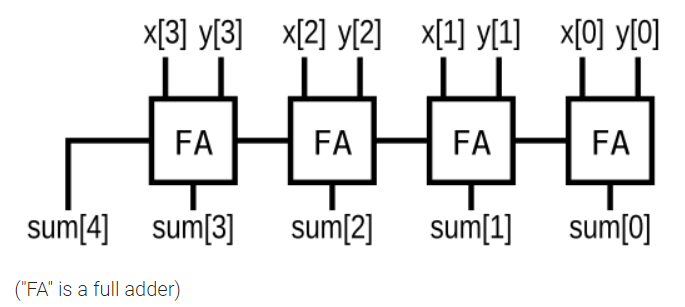

# Circuits -> Combinational Logic -> Arithmetic Circuits

## 66 Half adder
<details>
<summary>详情</summary>

创建一个半加法器。半加器将两位相加（没有进位）并产生和和进位。  

**分析**  
写就完事了。。。

**答案**  
```
module top_module( 
    input a, b,
    output cout, sum );
    
    assign {cout, sum} = a + b;

endmodule
```

</details>

## 67 Full adder
<details>
<summary>详情</summary>

创建一个全加器。全加器将三位相加（包括进位）并产生和和进位。  

**分析**  
写就完事了。。。  

**答案**  
```
module top_module( 
    input a, b, cin,
    output cout, sum );
    
    assign sum = a ^ b ^ cin;
    assign cout = a & b | a & cin | cin & b;

endmodule
```

</details>

## 68 3-bit binary adder
<details>
<summary>详情</summary>

现在您知道如何构建一个全加器，创建 3 个实例来创建一个 3 位二进制进位加法器。
加法器将两个 3 位数字和一个进位相加，产生一个 3 位sum和进位cout。
为了鼓励您实际实例化全加器，还要输出进位加法器中每个全加器的进位cout。
cout[2] 是最后一个全加器的最终进位，也是您通常看到的进位。  

**分析**  
博主没有例化全加器。。。

**答案**  
```
module top_module( 
    input [2:0] a, b,
    input cin,
    output [2:0] cout,
    output [2:0] sum );
    int i;
    always @(*) begin
        for(i = 0; i < 3 ; i = i + 1) begin
            if (i==0) begin
                sum[i] = a[i] ^ b[i] ^ cin;
                cout[i] = a[i] & b[i] | cin & b[i] | a[i] & cin;
            end
            else begin
                sum[i] = a[i] ^ b[i] ^ cout[i-1];
                cout[i] = a[i] & b[i] | cout[i-1] & b[i] | a[i] & cout[i-1];
            end
        end
    end

endmodule
```

</details>

## 69 Adder
<details>
<summary>详情</summary>

实现以下电路：  

  

**分析**  
四位全加器。。。只要sum。。。大漏洞。。。

**答案**  
```
module top_module (
    input [3:0] x,
    input [3:0] y, 
    output [4:0] sum);
    
    assign sum = x + y;

endmodule
```

</details>

## 70 Signed addition overflow
<details>
<summary>详情</summary>

假设您有两个 8 位 二进制 的补码，a[7:0] 和 b[7:0]。这些数字相加产生 s[7:0]。还要计算是否发生了（有符号的）溢出。  

**分析**  
什么是有符号的溢出？  
有符号数溢出有两种情况：一是`正正相加`，产生正溢出;另一种情况是`负负相减`，产生负溢出。  

补充知识：
- **无符号数溢出**： 当最高为向更高位有进位（或借位）时产生溢出，（数据的位宽变多了）
- **有符号数溢出**： 最高位和次最高位的进位标志，异或结果为1，则溢出。（还有其他的标准）  

**答案**  
```
module top_module (
    input [7:0] a,
    input [7:0] b,
    output [7:0] s,
    output overflow
); 
    
    reg [8:0] num;
 	assign num = a + b;
    assign s = num[7:0];
    assign overflow = ~s[7]&a[7]&b[7] | s[7]&~a[7]&~b[7];

endmodule
```

</details>

## 71 100-bit binary adder
<details>
<summary>详情</summary>

创建一个 100 位二进制加法器。加法器将两个 100 位数字和一个进位相加以产生一个 100 位sum和进位cout。

**分析**  
/狗头  

**答案**  
```
module top_module( 
    input [99:0] a, b,
    input cin,
    output cout,
    output [99:0] sum );
    
    assign {cout, sum} = a + b + cin;

endmodule
```

</details>

## 72 4-digit BCD adder
<details>
<summary>详情</summary>

为您提供了一个名为 bcd_fadd 的 BCD（二进制编码的十进制）一位加法器，
该加法器将两个 BCD 数字和进位相加，并产生一个sum和进位cout。
```
module bcd_fadd (
    input [3:0] a,
    input [3:0] b,
    input     cin,
    output   cout,
    output [3:0] sum );
```
实例化 4 个 bcd_fadd 以创建一个 4 位 BCD 进位加法器。
您的加法器应该得到一个4-digit的BCD加法器（4*4=16位）。  

**分析**  
偷不了懒了。。。  
给的 4bit BCD加法器。那我们就逐一例化把。。。  

**答案**  
```
module top_module ( 
    input [15:0] a, b,
    input cin,
    output cout,
    output [15:0] sum );
    
    wire single_0,single_1,single_2;
    bcd_fadd bcd_fadd_0 (a[3:0], b[3:0], cin, single_0, sum[3:0]);
    bcd_fadd bcd_fadd_1 (a[7:4], b[7:4], single_0, single_1, sum[7:4]);
    bcd_fadd bcd_fadd_2 (a[11:8], b[11:8], single_1, single_2, sum[11:8]);
    bcd_fadd bcd_fadd_3 (a[15:12], b[15:12], single_2, cout, sum[15:12]);

endmodule
```

</details>
