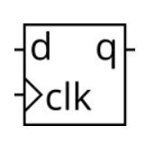
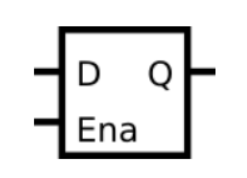
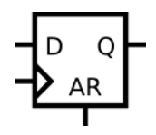
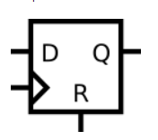

# Circuits -> Sequential Logic -> Latches and Flip-Flops

## 0 写在前面
- 本部分内容分为两部分
- [第一部分](./readme.md)
- [第二部分](./readme_1.md)  

## 81 D flip-flop
<details>
<summary>详情</summary>

创建一个D触发器。  

  

**分析**  
D触发器的赋值。。。应该懂吧。。。  
一般来讲，是在时钟的上升沿采集数据，将数据存储，把上一次存储的值传递给参数。即 `延迟一周期显示数据`。  

**答案**  
```
module top_module (
    input clk,    // Clocks are used in sequential circuits
    input d,
    output reg q );//

    always @(posedge clk)begin
        q <= d; 
    end

endmodule
```

</details>

## 82 D flip-flops
<details>
<summary>详情</summary>

创建8个D触发器。时钟上升沿触发。  

**分析**  
rush...  

**答案**  
```
module top_module (
    input clk,
    input [7:0] d,
    output [7:0] q
);
    always @(posedge clk)begin
        q <= d; 
    end

endmodule
```

</details>

## 83 DFF with reset
<details>
<summary>详情</summary>

创建 8 个具有高电平有效同步复位的 D 触发器。所有 DFF 都应由 clk 的上升沿触发。  

**分析**  
rush...

**答案**  
```
module top_module (
    input clk,
    input reset,            // Synchronous reset
    input [7:0] d,
    output [7:0] q
);
    always @(posedge clk)begin
        if (reset)
            q <= 8'b0;
        else
        	q <= d; 
    end

endmodule
```

</details>

## 84 DFF with reset value
<details>
<summary>详情</summary>

创建 8 个具有高电平有效同步复位的 D 触发器。触发器必须重置为 0x34 而不是零。所有 DFF 都应由 clk 的下降沿触发。  

**分析**  
rush...

**答案**  
```
module top_module (
    input clk,
    input reset,
    input [7:0] d,
    output [7:0] q
);
    always @(negedge clk)begin
        if (reset)
            q <= 8'h34;
        else
        	q <= d; 
    end

endmodule
```

</details>

## 85 DFF with asynchronous reset
<details>
<summary>详情</summary>

创建 8 个具有高电平有效`异步复位`的 D 触发器。所有 DFF 都应由 clk 的上升沿触发。   

**分析**  
rush... 

**答案**  
```
module top_module (
    input clk,
    input areset,   // active high asynchronous reset
    input [7:0] d,
    output [7:0] q
);
    always @(posedge clk or posedge areset)begin
        if (areset)
            q <= 8'b0;
        else
        	q <= d; 
    end

endmodule
```

</details>

## 86 DFF with byte enable
<details>
<summary>详情</summary>

创建 16 个 D 触发器。有时只修改一组触发器的一部分很有用。
字节使能输入控制 16 个寄存器中的每个字节是否应在该周期写入。
byteena[1] 控制高字节 d[15:8]，而 byteena[0] 控制低字节 d[7:0]。  
resetn 是一个同步的低电平有效复位。  
所有 DFF 都应由 clk 的上升沿触发。   

**分析**  
多一个选择器？  
注意一下，可以全都要。  

**答案**  
```
module top_module (
    input clk,
    input resetn,
    input [1:0] byteena,
    input [15:0] d,
    output [15:0] q
);
    always @(posedge clk) begin
        if (~resetn)
            q <= 16'b0;
        else begin 
            if(byteena[0])
                q[7:0] <= d[7:0];
            if(byteena[1])
                q[15:8] <= d[15:8]; 
        end
    end

endmodule
```

</details>

## 87 D Latch
<details>
<summary>详情</summary>

创建一个D锁存器。

   

**分析**  
**锁存器相比触发器会消耗更多的资源。** 

**答案**  
```
module top_module (
    input d, 
    input ena,
    output q);
    
    assign q = ena ? d : q; 

endmodule
```

</details>

## 88 DFF
<details>
<summary>详情</summary>

完成以下电路。

   

**分析**  
应该能认出来这个是D触发器把。。。AR是异步复位的缩写（asynchronous reset）。 

**答案**  
```
module top_module (
    input clk,
    input d, 
    input ar,   // asynchronous reset
    output q);
    
    always @(posedge clk or posedge ar) begin 
        if(ar) q <= 1'b0;
        else q <= d;
    end

endmodule
```

</details>

## 89 DFF
<details>
<summary>详情</summary>

完成以下电路。

   

**分析**  
R是同步复位的缩写（reset）。 

**答案**  
```
module top_module (
    input clk,
    input d, 
    input r,   // synchronous reset
    output q);
    
    always @(posedge clk)
        if (r) q <= 0;
        else q <= d;

endmodule
```

</details>
