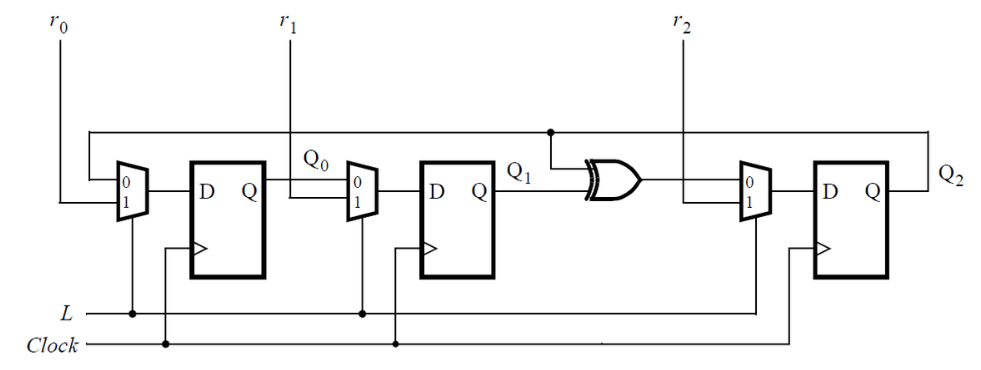
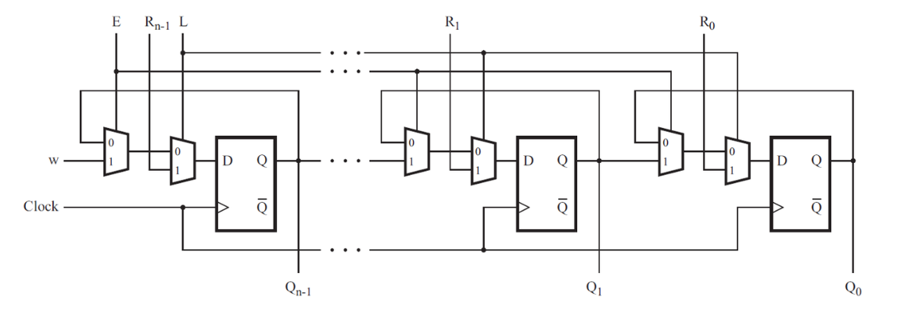
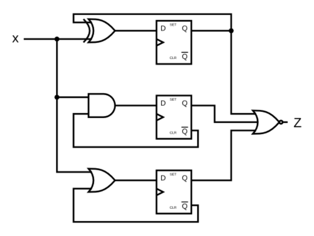
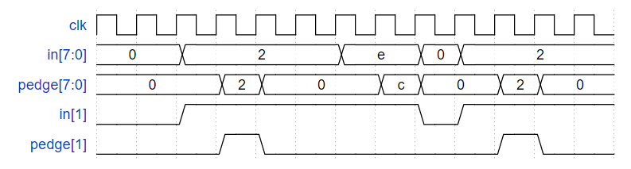
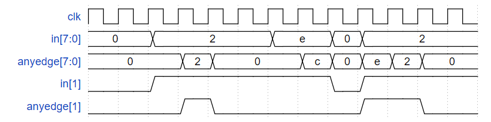
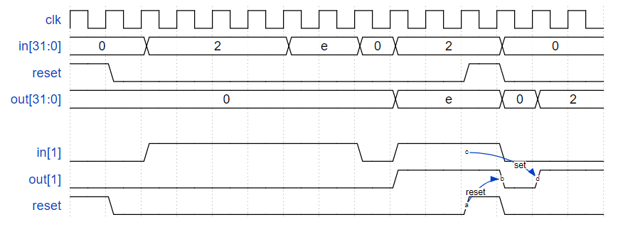
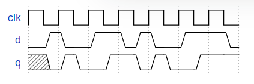

# Circuits -> Sequential Logic -> Latches and Flip-Flops

## 0 写在前面
- 本部分内容分为两部分
- [第一部分](./readme.md)
- [第二部分](./readme_1.md)  

## 90 DFF+gate
<details>
<summary>详情</summary>

完成以下电路。  

  

**分析**  
组合逻辑+时序逻辑。  
这里展示的内容也是和C最大的不同。  
硬件描述语言(verilog)是`并行执行语言`。  

**答案**  
```
module top_module (
    input clk,
    input in, 
    output out);
    
    wire sum,out_0;
    always @(posedge clk)begin
        out_0 <= sum;
    end
    assign sum = out_0 ^ in;
    assign out = out_0;

endmodule
```

</details>

## 91 Mux and DFF
<details>
<summary>详情</summary>

以下的时序电路。  

  

完成其中一个就行。  

**分析**  
选择器+D触发器  

**答案**  
```
module top_module (
	input clk,
	input L,
	input r_in,
	input q_in,
	output reg Q);
    
    always @(posedge clk)
    	Q <= L ? r_in : q_in;

endmodule
```

</details>

## 92 Mux and DFF
<details>
<summary>详情</summary>

考虑如下所示的 n 位移位寄存器电路。  

  

完成其中一个模块就行。  

**分析**  
两个选择器+D触发器。。。    

**答案**  
```
module top_module (
    input clk,
    input w, R, E, L,
    output Q
);
    wire [1:0] temp;
    reg out;
    assign temp[0] = E ? w : Q;
    assign temp[1] = L ? R : temp[0];
    
    always @(posedge clk) begin
        out <= temp[1];
    end
    
    assign Q = out;

endmodule
```

</details>

## 93 DFFs and gates
<details>
<summary>详情</summary>

给定如图所示的有限状态机电路，假设 D 触发器在机器开始之前初始复位为零。  
创建以下电路。  



**分析**  
看图说话...

**答案**  
```
module top_module (
    input clk,
    input x,
    output z
); 
    reg [2:0] num;
    always @(posedge clk) begin
        num[2] <= num[2] ^ x;
        num[1] <= x & ~num[1];
        num[0] <= x | ~num[0];
    end
    assign z = ~(|num);

endmodule
```

</details>

## 94 Create circuit from truth table
<details>
<summary>详情</summary>

JK 触发器具有以下真值表。实现一个只有 D 型触发器和门的 JK 触发器。注意：Qold 是正时钟沿之前 D 触发器的输出。  

|**J**|**K**|**Q**|
|:---:|:---:|:---:|
|0|0|Qold|
|0|1|0|
|1|0|1|
|1|1|~Qold|

**分析**  
rush...

**答案**  
```
module top_module (
    input clk,
    input j,
    input k,
    output Q); 
    
    always @(posedge clk) begin
        case({j,k})
            2'b00: Q <= Q;
            2'b01: Q <= 1'b0;
            2'b10: Q <= 1'b1;
            2'b11: Q <= ~Q;
            default: Q <= 1'b0;
        endcase
    end

endmodule
```

</details>

## 95 Detect an edge
<details>
<summary>详情</summary>

对于 8 位向量中的每一位，检测输入信号何时从一个时钟周期的 0 变为下一个时钟周期的 1（类似于上升沿检测）。输出位应在发生 0 到 1 转换后的周期设置。  
这里有些例子。为清楚起见，in[1] 和 pedge[1] 分别显示。  

  

**分析**  
也就是每一位进行上升沿检测...  
一般而言，边沿检测都是将信号打一拍，对比前后状态发生改变则触发检测。  
冷知识：（博主这里只放结论，结论为何是这样，画一下时序图）  
- 输入为`in`，打一拍为`temp`
- 上升沿检测：`~temp & in`
- 下降沿检测：`temp & ~in`  

**答案**  
```
module top_module (
    input clk,
    input [7:0] in,
    output [7:0] pedge
);
    reg [7:0] temp;
    always @(posedge clk)begin
        temp <= in;
        pedge <= ~temp & in;
    end

endmodule
```

</details>

## 96 Detect both edge
<details>
<summary>详情</summary>

对于 8 位向量中的每一位，检测输入信号何时从一个时钟周期变为下一个时钟周期（检测任何边沿）。输出位应在发生 0 到 1 转换后的周期设置。  
这里有些例子。为清楚起见，in[1] 和 anyedge[1] 分别显示。   

  

**分析**  
也就是双边沿检测。。。  
还是打一拍。。。  
画一下时序图。。。  
是xor（异或）的关系。。。

**答案**  
```
module top_module (
    input clk,
    input [7:0] in,
    output [7:0] anyedge
);
    reg [7:0] temp;
    always @(posedge clk)begin
        temp <= in;
        anyedge <= temp ^ in;
    end

endmodule
```

</details>

## 97 Edge capture register
<details>
<summary>详情</summary>

对于 32 位向量中的每一位，在输入信号从一个时钟周期的 1 变为下一个时钟周期的 0 时进行捕捉。 
“捕获”表示输出将保持为 1，直到寄存器复位（同步复位）。  
每个输出位的行为类似于 SR 触发器：输出位应在 1 到 0 转换发生后的周期设置（为 1）。
当复位为高电平时，输出位应在正时钟沿复位（为 0）。如果上述两个事件同时发生，则重置优先。  
在下面示例波形的最后 4 个周期中，“reset”事件比“set”事件早一个周期发生，因此这里不存在冲突。  
在下面的示例波形中，为清楚起见，reset、in[1] 和 out[1] 再次分别显示。  

   

**分析**  
也就是我们进行`输入从1到0`的`下降沿检测`，检测到结果后，该位置1，直到复位发生，置0。  
也就是我们一直进行上升沿检测，将检测的结果存放到temp中，  
将temp的状态与结果进行or(或)运算，即可得到输出。  

**答案**  
```
module top_module (
    input clk,
    input reset,
    input [31:0] in,
    output [31:0] out
);
    reg [31:0] temp;
    always @(posedge clk)begin
        temp <= in;
        if (reset) out <= 32'b0;
        else out <= temp & ~in | out;
    end

endmodule
```

</details>

## 98 Dual-edge triggered flip-flop
<details>
<summary>详情</summary>

您熟悉在时钟上升沿或时钟下降沿触发的触发器。在时钟的两个边沿触发双边触发触发器。
但是，`FPGA 没有双边触发触发器`，并且始终`不接受` @(posedge clk 或 negedge clk) 作为合法的敏感度列表。  
构建一个功能类似于双边触发触发器的电路。  

   

**分析**  
不让我写一起，我分开来写？  

**答案**  
```
module top_module (
    input clk,
    input d,
    output q
);
    reg q1,q2;
    always @(posedge clk) begin
        q1 <= d;
    end
    always @(negedge clk) begin
        q2 <= d;
    end
    
    assign q = clk ? q1 : q2;

endmodule
```

</details>

