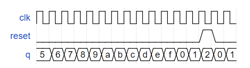
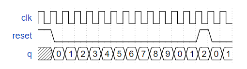
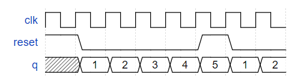
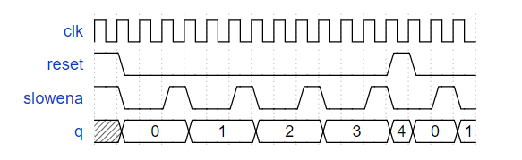
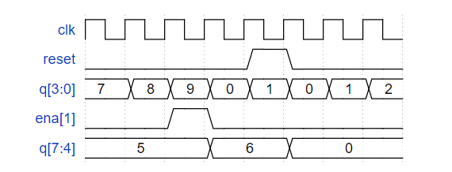
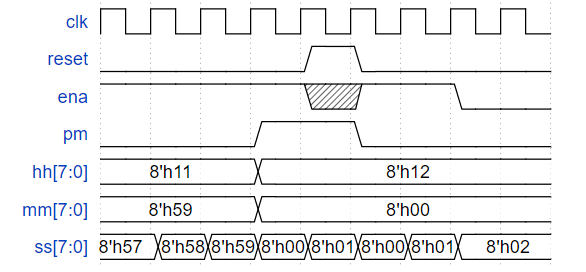

# __Circuits_Sequential Logic_Counter Record__

## 99 Four-bit binary counter
<details>
<summary>详情</summary>

构建一个从 0 到 15（含）计数的 4 位二进制计数器，周期为 16。复位输入是同步的，应将计数器复位为 0。  
时序图示例  
  

**分析**  
`q`从0开始叠加到f，往复叠加即可。

**答案**  
```
module top_module (
    input clk,
    input reset,      // Synchronous active-high reset
    output [3:0] q);
    
    always @(posedge clk)begin
        if (reset) 
            q <= 4'b0;
        else
            q <= q + 1'b1;
    end
endmodule
```

</details>

## 100 Decade counter
<details>
<summary>详情</summary>

构建一个从 0 到 9 计数的十进制计数器，周期为 10。复位输入是同步的，应将计数器复位为 0。  
时序图示例  
  

**分析**  
与`99`类似。

**答案**  
```
module top_module (
    input clk,
    input reset,        // Synchronous active-high reset
    output [3:0] q);
    
    always @(posedge clk)begin
        if (reset ) q <= 4'b0;
        else begin
            if (q == 4'd9) q <= 4'b0;
            else q <= q + 1'b1;
        end
    end
endmodule
```

</details>

## 101 Decade counter again
<details>
<summary>详情</summary>

构建一个从 1 到 10 计数的十进制计数器。复位输入是同步的，应将计数器复位为 1。  
时序图示例  
  

**分析**  
与`99`类似。

**答案**  
```
module top_module (
    input clk,
    input reset,
    output [3:0] q);
    always @(posedge clk)begin
        if (reset) q <= 4'b1;
        else begin
            if (q == 4'd10) q <= 4'b1;
            else q <= q + 1'b1;
        end
    end

endmodule
```

</details>

## 102 Slow decade counter
<details>
<summary>详情</summary>

构建一个从 0 到 9 计数的十进制计数器，周期为 10。
复位输入是同步的，应该将计数器复位为 0。
我们希望能够暂停计数器，而不是总是在每个时钟周期递增，所以 slowena 输入指示计数器何时应该增加。  
时序图示例  
  

**分析**  
与之前相比，原先自动增加计数器，改为根据信号增加计数器。

**答案**  
```
module top_module (
    input clk,
    input slowena,
    input reset,
    output [3:0] q);
    always @(posedge clk)begin
        if (reset) q <= 4'b0;
        else begin
            if (slowena) begin
                if (q == 4'd9) q <= 4'b0;
                else q <= q + 1'b1;
            end
            else q <= q;
        end
    end

endmodule
```

</details>

## 103 Counter 1-12
<details>
<summary>详情</summary>

没看懂，没整明白，这里贴一个大佬的解答。  
[这是个单纯答案](./103_Counter%201-12.v)  
[这是个知乎答案](https://zhuanlan.zhihu.com/p/62805600)

</details>

## 104 Counter 1000
<details>
<summary>详情</summary>

从 1000 Hz 时钟导出一个称为 OneHertz 的 1 Hz 信号，该信号可用于驱动一组小时/分钟/秒计数器的启用信号，以创建数字挂钟。
由于我们希望时钟每秒计数一次，因此 OneHertz 信号必须每秒准确地断言一个周期。
使用模 10 (BCD) 计数器和尽可能少的其他门构建分频器。
还要从您使用的每个 BCD 计数器输出使能信号（c_enable[0] 为高位，c_enable[2] 为低位）。  

提供了BCD计数器，Enable 必须为高电平才能使计数器运行。复位是同步的并设置为高以强制计数器为零。电路中的所有计数器必须直接使用相同的 1000 Hz 信号。  
```
module bcdcount (
	input clk,
	input reset,
	input enable,
	output reg [3:0] Q
);
``` 

**分析**  
将 1000 Hz 分频为 1 Hz。 BCD 计数器为记满 10 使能一次。  
使用`3个BCD 计数器`，充当个位、十位、百位。  
当计数器为`999`时，下一次使能`OneHertz`。  

**答案**  
```
module top_module (
    input clk,
    input reset,
    output OneHertz,
    output [2:0] c_enable
); //
    
    wire [3:0] q0,q1,q2;
    // 各位叠加标志
	assign c_enable =  {q1 == 4'd9 && q0 == 4'd9, q0 == 4'd9, 1'b1};
    assign OneHertz = {q2 == 4'd9 && q1 == 4'd9 && q0 == 4'd9};
    bcdcount counter0 (clk, reset, c_enable[0], q0);
    bcdcount counter1 (clk, reset, c_enable[1], q1);
    bcdcount counter2 (clk, reset, c_enable[2], q2);

endmodule
```

</details>

## 105 4-digit decimal counter
<details>
<summary>详情</summary>

构建一个 4 位 BCD（二进制编码的十进制）计数器。
每个十进制数字使用 4 位编码：`q[3:0] 是个位，q[7:4] 是十位等`。
对于ena[3:1]，表示每个位的递增。  

**给出一位的时序图示例**  
  

**分析**  
四位计数。每一位均有`使能和进位`输出。  
由此，我们可以拆分为四个模块，每个模块控制一位变化。 
可以直接`assign` `ena`的值。

**答案**  
```
module top_module (
    input clk,
    input reset,   // Synchronous active-high reset
    output [3:1] ena,
    output [15:0] q);
    
    test u_test(        
        .clk(clk),
        .reset(reset),
        .ena(1'b1),
        .q(q[3:0])
    );
    
    test u_test1(        
        .clk(clk),
        .reset(reset),
        .ena(ena[1]),
        .q(q[7:4])
    );
    
    test u_test2(        
        .clk(clk),
        .reset(reset),
        .ena(ena[2]),
        .q(q[11:8])
    );
    
    test u_test3(        
        .clk(clk),
        .reset(reset),
        .ena(ena[3]),
        .q(q[15:12])
    );
    // 是否进位标志
    assign ena = {q[11:8] == 4'd9 && q[7:4] == 4'd9 && q[3:0] == 4'd9, q[7:4] == 4'd9 && q[3:0] == 4'd9, q[3:0] == 4'd9};
    
endmodule


module test (
    input clk,
    input reset,   // Synchronous active-high reset
    input  ena,
    output reg [3:0] q);
    
    always @(posedge clk) begin
        if (reset) begin 
            q <= 4'b0;
        end 
        else if (ena) begin
            if (q == 4'd9)
                q <= 4'd0;
            else
                q <= q + 1'b1;
        end
    end
endmodule  

```

</details>

## 106 12-hour clock
<details>
<summary>详情</summary>

创建一组适合用作 12 小时制的计数器（带有上午/下午指示器）。
您的计数器由一个快速运行的 clk 计时，只要您的时钟应该增加（即每秒一次），就会在 ena 上发出一个脉冲。  
reset 将时钟重置为 12:00 AM。 pm 对于 AM 为 0，对于 PM 为 1。
hh、mm 和 ss 是两个 BCD（二进制编码的十进制）数字，分别表示小时 (01-12)、分钟 (00-59) 和秒 (00-59)。
重置的优先级高于启用，即使未启用也可能发生。  

以下时序图显示了从上午 11:59:59 到下午 12:00:00 的翻转行为以及同步复位和启用行为。  
  

**分析**  
- 首先可以写出`pm`的逻辑关系。  
- 时分秒，共计6位BCD显示，可做六个模块。  
- 分别控制`使能与进位`。  

**notes**  
- 与之前不同，之前均是10进制，时钟分为十进制与六进制，得调整
- module_name #(.pram(0)) u_module_name ();

**答案**  
```
module top_module (
    input clk,
    input reset,
    input ena,
    output pm,
    output [7:0] hh,
    output [7:0] mm,
    output [7:0] ss
);

wire [4:1] ena_temp;
// 00:00:00
assign ena_temp[1] = ena && ss[3:0] == 8'd9;
assign ena_temp[2] = ena_temp[1] && ss[7:4] == 8'd5;
assign ena_temp[3] = ena_temp[2] && mm[3:0] == 8'd9;
assign ena_temp[4] = ena_temp[3] && mm[7:4] == 8'd5;

cout #(.cin_cnt(9)) ss9 (clk, reset, ena, ss[3:0]);
cout #(.cin_cnt(5)) ss5 (clk, reset, ena_temp[1], ss[7:4]);
cout #(.cin_cnt(9)) mm9 (clk, reset, ena_temp[2], mm[3:0]);
cout #(.cin_cnt(5)) mm5 (clk, reset, ena_temp[3], mm[7:4]);
cout_h u_hh (clk, reset, ena_temp[4], hh);

// pm时序
always @(posedge clk)begin
    if (reset) pm <= 1'b0;
    if (ena_temp[4] && hh == 8'h11) pm <= ~pm;
end

endmodule

module cout (
    input clk,
    input reset,
    input ena,
    output reg [3:0] q
);
parameter cin_cnt = 9;
always @(posedge clk)
    if (reset) q <= 4'b0;
    else if (ena) begin
        if (q == cin_cnt)
            q <= 4'd0;
        else
            q <= q + 1'b1;
    end
endmodule

module cout_h (
    input clk,
    input reset,
    input ena,
    output reg [7:0] cout
);
always @(posedge clk)begin
    if (reset) begin
        cout <= 8'h12;
    end
    else begin
        if (ena) begin
            case (cout)
                8'h12: cout <= 8'h01;
                8'h09: cout <= 8'h10;
                default: cout[3:0] <= cout[3:0] + 1;
            endcase
        end
        else cout <= cout;
    end
end

endmodule

```

</details>

