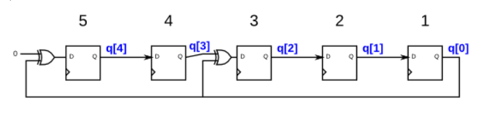
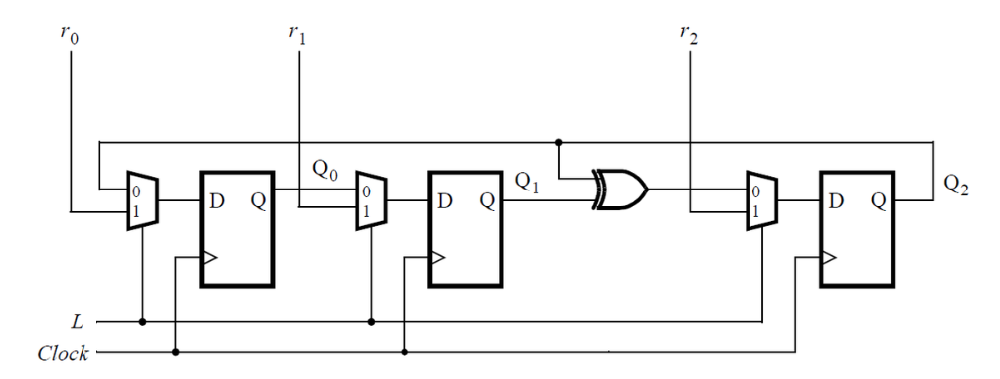
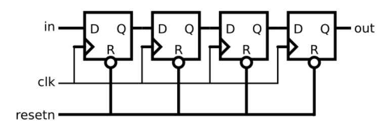
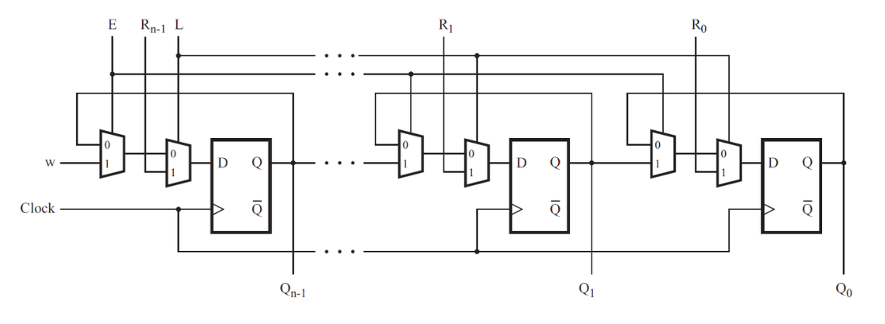

# Circuits -> Sequential Logic -> Shift Registers

## 107 4-bit shift register
<details>
<summary>详情</summary>

构建一个 4 位移位寄存器（右移），具有异步复位、同步加载和启用。     
- areset : 寄存器复位为0
- load : 将data[3:0]输入至移位寄存器中
- ena : 使能信号控制向右移动（q[3]q[2]q[1]q[0] ---> 0q[3]q[2]q[1]，q[0]在移动后消失了，原先q[3]的位置变为0）
- q : 移位寄存器中的数据  
**note:如果ena和load同时为高，load有更高的优先级。**

**分析**  
注意异步复位。

**答案**  
```
module top_module(
    input clk,
    input areset,  // async active-high reset to zero
    input load,
    input ena,
    input [3:0] data,
    output reg [3:0] q); 
    
    reg [3:0] data_temp;
    always @(posedge clk or posedge areset) begin
        if (areset) data_temp <= 4'b0;
        else if (load) data_temp <= data;
        else if (ena)begin
            if (load) data_temp <= data;
            else data_temp <= {1'b0, data_temp[3:1]};
        end
    end
    
    assign q = data_temp;

endmodule
```

</details>

## 108 Left - right rotator
<details>
<summary>详情</summary>

构建一个 100 位左/右旋转器，具有同步加载和左/右使能。
与丢弃移出位并移入零的移位器不同，旋转器从寄存器的另一端移入移出的位。
如果启用，旋转器会旋转位并且不会修改/丢弃它们。 
- load：load信号将data[99:0] 输入至寄存器内。
- ena[1:0] 信号选择是否移位和移位的具体方向
  - 2'b01 ：右移一位
  - 2'b10 ：左移一位
  - 2'b00 和 2'b11不移动
- q：移位后寄存器内的数据

**分析**  
注意条件判断。左移与右移的写法。  

**答案**  
```
module top_module(
    input clk,
    input load,
    input [1:0] ena,
    input [99:0] data,
    output reg [99:0] q); 
    
    reg [99:0] data_temp;
    always @(posedge clk) begin
        if (load) data_temp <= data;
        else case(ena)
            2'b01: data_temp <= {data_temp[0], data_temp[99:1]};
            2'b10: data_temp <= {data_temp[98:0], data_temp[99]};
            default: data_temp <= data_temp;
        endcase
    end

    assign q = data_temp;

endmodule
```

</details>

## 109 Left - right arithmetic shift by 1 or 8
<details>
<summary>详情</summary>

构建一个 64 位算术移位寄存器，同步加载。移位器可以向左和向右移动 1 位或 8 位位置，由数量选择。
算术右移移位寄存器中数字的符号位（在这种情况下为 q[63]），而不是逻辑右移所完成的零。  
考虑算术右移的另一种方法是，它假设被移动的数字是有符号的并保留符号，因此算术右移将带符号的数字除以 2 的幂。  
逻辑左移和算术左移没有区别。  
- load ： 置位信号。
- ena ： 使能信号，来选择是否移位
- amount ： 选择移位的方向和移位的个数
  - 2'b00 : 左移1bit
  - 2’b01 : 左移8bit
  - 2'b10 : 右移1bit
  - 2'b11 : 右移8bit  
- q ： 寄存器中哦的数据  

**提示：5 位数 11000 算术右移 1 是 11100，而逻辑右移将产生 01100。
类似地，一个 5 位数字 01000 算术右移 1 是 00100，并且逻辑右移会产生相同的结果，因为原始数字是非负数。**

**分析**  
逻辑左右移是整体移动，算数左移也是一样。  
算数右移需考虑符号位，且**右移缺失部分用符号位补充**。  

**答案**  
```
module top_module(
    input clk,
    input load,
    input ena,
    input [1:0] amount,
    input [63:0] data,
    output reg [63:0] q); 
    
    reg [63:0] data_temp;
    always @(posedge clk) begin
        if (load) data_temp <= data;
        else if (ena)
        	case(amount)
                2'b00: data_temp <= {data_temp[62:0], 1'b0};
                2'b01: data_temp <= {data_temp[55:0], 8'b0};
                2'b10: data_temp <= {{2{data_temp[63]}}, data_temp[62:1]};
                2'b11: data_temp <= {{9{data_temp[63]}}, data_temp[62:8]};
        	endcase
        else data_temp <= data_temp;
    end

    assign q = data_temp;

endmodule

```

</details>

## 110 5-bit LFSR
<details>
<summary>详情</summary>

线性反馈移位寄存器(LFSR)是通常带有几个XOR门来产生下一状态的移位寄存器。
Galois LFSR是一个特殊的移位寄存器。其中带有"tap"位的位置与输出位XOR产生下一个值没有"tap"位标志的正常移位。
如果"tap"位置经过仔细选择后，LFSR将设置为最大长度。再重复之前LFSR的最大长度为2^n-1。     

下图所示LFSR为在位置5和位置3包含"tap"位的5-bit最大长度LFSR。开始为位置1，输入为0。  
  

**分析**  
看图说话？

**答案**  
```
module top_module(
    input clk,
    input reset,    // Active-high synchronous reset to 5'h1
    output [4:0] q
); 
    reg [4:0] temp;
    always @(posedge clk) begin
        if (reset) temp <= 5'h1;
        else begin 
            temp[4] <= 1'b0 ^ temp[0];
            temp[3] <= temp[4];
            temp[2] <= temp[3] ^ temp[0];
            temp[1] <= temp[2];
            temp[0] <= temp[1];
        end
    end
    assign q = temp;

endmodule
```

</details>

## 111 3-bit LFSR
<details>
<summary>详情</summary>

为这个时序电路编写 Verilog 代码（子模块可以，但顶层必须命名为 top_module）。
假设您要在 DE1-SoC 板上实现电路。
将 R 输入连接到 SW 开关，将 Clock 连接到 KEY[0]，将 L 连接到 KEY[1]。将 Q 输出连接到红灯 LEDR。  

给出示意图。  
  

**分析**  
和110差不多，看图说话。  
要搞清楚，当选择器为1时，Q的表达方式。  

**答案**  
```
module top_module (
	input [2:0] SW,      // R
	input [1:0] KEY,     // L and clk
	output [2:0] LEDR);  // Q
    
    reg [2:0] temp;
    always @(posedge KEY[0]) begin
        temp <= KEY[1] ? SW : {temp[1] ^ temp[2], temp[0], temp[2]};
    end
    assign LEDR = temp;
    
endmodule

```

</details>

## 112 32-bit LFSR
<details>
<summary>详情</summary>

在位置 32、22、2 和 1 处构建具有抽头的 32 位 Galois LFSR。     
建议使用向量，而不是32个例化器。  

**分析**  
所谓向量表达，即，将输出Q表示出来，与111类似。

**答案**  
```
module top_module(
    input clk,
    input reset,    // Active-high synchronous reset to 32'h1
    output [31:0] q
); 
    reg [31:0] temp;
    always @(posedge clk) begin
        if (reset) temp <= 32'h1;
        else begin
            temp <= {temp[0],temp[31:23],temp[22]^temp[0],temp[21:3],temp[2]^temp[0],temp[1]^temp[0]};
        end
    end
    assign q = temp;

endmodule

```

</details>

## 113 Shift register
<details>
<summary>详情</summary>

实现以下电路。     
  

**分析**  
无。

**答案**  
```
module top_module (
    input clk,
    input resetn,   // synchronous reset
    input in,
    output out);
    
    reg q0,q1,q2;
    always @(posedge clk) begin
        if (~resetn) begin 
            out <= 1'b0;
            q0 <= 1'b0;
            q1 <= 1'b0;
            q2 <= 1'b0;
        end
        else begin
            q0 <= in;
            q1 <= q0;
            q2 <= q1;
            out <= q2;
        end
    end

endmodule
```

</details>

## 114 Shift register
<details>
<summary>详情</summary>

考虑如下所示的 n 位移位寄存器电路。    
  

假设 n = 4，为移位寄存器编写顶层 Verilog 模块（名为 top_module）。在顶层模块中实例化四个 MUXDFF 子电路。
- 将 R 输入连接到 SW 开关，
- clk 到 KEY[0]，
- E 到 KEY[1]，
- L 到 KEY[2]，
- w 到 KEY[3]，
- 将输出连接到红灯 LEDR[3:0]。

**分析**  
整明白输入输出。

**答案**  
```
module top_module (
    input [3:0] SW,
    input [3:0] KEY,
    output [3:0] LEDR
); //
    // clk,E,L,INPUT_Q,W,R,OUT
    MUXDFF U_MUXDFF_3(KEY[0], KEY[1], KEY[2], LEDR[3], KEY[3], SW[3], LEDR[3]);
    MUXDFF U_MUXDFF_2(KEY[0], KEY[1], KEY[2], LEDR[2], LEDR[3], SW[2], LEDR[2]);
    MUXDFF U_MUXDFF_1(KEY[0], KEY[1], KEY[2], LEDR[1], LEDR[2], SW[1], LEDR[1]);
    MUXDFF U_MUXDFF_0(KEY[0], KEY[1], KEY[2], LEDR[0], LEDR[1], SW[0], LEDR[0]);
   
endmodule

module MUXDFF (
    input clk,
    input E,
    input L,
    input q0,
    input W,
    input R,
    output q
    );
    reg q_t;
    assign q_t = L ? R : (E ? W : q0);
    always @(posedge clk)begin
        q <= q_t;
    end

endmodule

```

</details>

## 115 3-input LUT
<details>
<summary>详情</summary>

在这个问题中，您将为 8x1 存储器设计一个电路，其中写入存储器是通过移入位来完成的，而读取是“随机访问”，就像在典型的 RAM 中一样。
然后，您将使用该电路实现 3 输入逻辑功能。   
首先，创建一个带有 8 个 D 型触发器的 8 位移位寄存器。
标记来自 Q[0]...Q[7] 的触发器输出。
移位寄存器输入应称为 S，它馈入 Q[0] 的输入（首先移入 MSB）。
使能输入控制是否移位。然后，将电路扩展为具有 3 个附加输入 A、B、C 和一个输出 Z。
电路的行为应如下：当 ABC 为 000 时，Z=Q[0]，当 ABC 为 001 时，Z=Q[1]， 等等。
您的电路应该只包含 8 位移位寄存器和多路复用器。 （旁白：此电路称为 3 输入查找表 (LUT)）。  

**分析**  
移位寄存器输入S应存放在Q[0]，
原先的Q移除最高位。  
因此`{Q[6:0], S}`

**答案**  
```
module top_module (
    input clk,
    input enable,
    input S,
    input A, B, C,
    output Z ); 
    
    reg[7:0] temp;
    always@(posedge clk)begin
        if(enable) temp	<= {temp[6:0], S};
    end
    assign Z = temp[{A,B,C}];

endmodule

```

</details>
