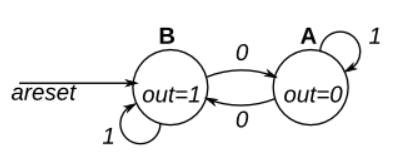
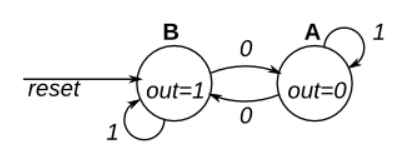

# Circuits -> Sequential Logic -> More Circuits

## 116 Rule 90
<details>
<summary>详情</summary>

Rule90 是一道根据一些有趣的规则来生成一维序列的题目。
规则很简单。一维序列中元素有 1,0 两种状态，分别对应开，关状态。
在每个时钟边沿到来时刻，元素的下一个状态为元素相邻两个元素的异或。
下表更详细地给出了跳变的规则，（可以视为状态转移表），元素下一个状态可以视作输出，输入为元素本身的状态与相应两个相邻元素的当前状态。  
  
`冷知识：“Rule 90”这个名字来自于上述“next state”一栏：01011010是十进制的90`  
本题创建一个 512 单元系统 (q[511:0])，并在每个时钟周期前进一个时间步长。
加载输入指示系统的状态应加载数据[511:0]。假设边界（q[-1] 和 q[512]）都为零（关闭）

**分析**  
由特殊到一般。  
读者可以写一下4位的Rule90 案例。

**答案**  
```
module top_module(
    input clk,
    input load,
    input [511:0] data,
    output [511:0] q ); 
    reg [511:0] q_temp;
    always @(posedge clk)begin
        if (load) q_temp <= data;
        else q_temp <= {q_temp[510:0], 1'b0} ^ {1'b0, q_temp[511:1]}; 
    end
    assign q = q_temp;

endmodule

```

</details>

## 117 Rule 110
<details>
<summary>详情</summary>

与116类似，在每个时钟边沿到来时刻，元素的下一个状态取决于元素本身的状态与前后两个相邻元素的当前状态。  
详细规则如下：  
  
`冷知识：“Rule 110”这个名字来自于上述“next state”一栏：01101110是十进制的110`  
本题创建一个 512 单元系统 (q[511:0])，并在每个时钟周期前进一个时间步长。
加载输入指示系统的状态应加载数据[511:0]。假设边界（q[-1] 和 q[512]）都为零（关闭）

**分析**  
卡诺图化简。  

**答案**  
```
module top_module(
    input clk,
    input load,
    input [511:0] data,
    output [511:0] q );
    reg [511:0] q_temp;
    always @(posedge clk)begin
        if (load) q_temp <= data;
        else q_temp <= (q_temp ^ (q_temp<<1)) | ~(q_temp>>1)&q_temp&(q_temp<<1);
    end
    assign q = q_temp;
endmodule

```

</details>

## 118 Cinway - Game of Life
<details>
<summary>详情</summary>

本题的变换工作在一个二维矩阵上，是一个二维序列生成器。  
“游戏”是在一个二维单元格上进行的，其中每个单元格要么是 1（活着），要么是 0（死去）。
在每个时间步，每个单元格都会根据它所在九宫格的1的个数来改变状态：  
- 0-1 ：元素变为 0。
- 2 ：元素不变。
- 3 ：元素变为 1。
- 4 个以上 ：元素变为 0。  

该游戏是为无限网格制定的。在这个电路中，我们将使用 16x16 网格。
为了让事情更有趣，我们将使用一个 16x16 的环形，其中边环绕到网格的另一边。
例如，角单元 (0,0) 有 8 个邻居：(15,1), (15,0), (15,15), (0,1), (0,15), (1,1) , (1,0), 和 (1,15)。
16x16 的网格由一个长度为 256 的向量表示，其中每行 16 个单元格由一个子向量表示：
q[15:0] 为第 0 行，q[31:16] 为第 1 行，以此类推（此工具接受 SystemVerilog，因此您可以根据需要使用 2D 向量。）  

load 信号有效时，更新 q 信号值为初始值 data, q 每个周期变换一次。  

**分析**  
先把 `16x16 网格` 转成 `18x18 网格`。  
需要注意一下位次。

**答案**  
```
module top_module(
input clk,
input load,
input [255:0] data,
output [255:0] q );

    int i,j;
    reg [255:0] q_temp;
    wire [17:0] q_ext[17:0];
    always@(*) begin
        for(i=0;i<18;i=i+1)begin
            if (i==0) q_ext[0][17:0] = {q_temp[240], q_temp[255:240], q_temp[255]};
            else if (i==17) q_ext[17][17:0] = {q_temp[0], q_temp[15:0], q_temp[15]};
            else q_ext[i][17:0] = {q_temp[16*i-16], q_temp[(i*16-1)-:16], q_temp[16*i-1]};
        end
    end


    wire [2:0] q_num_temp[15:0][15:0];
    always@(*) begin
        for(i=1;i<17;i=i+1)begin
            for(j=1;j<17;j=j+1)begin
                q_num_temp[i-1][j-1] = q_ext[i-1][j-1] + q_ext[i-1][j] + q_ext[i-1][j+1]
                                     + q_ext[i][j-1]                   + q_ext[i][j+1]
                                     + q_ext[i+1][j-1] + q_ext[i+1][j] + q_ext[i+1][j+1];
            end
        end
    end

    always @(posedge clk)begin
        if(load)begin
            q_temp <= data;
        end
        else begin
            for(i=0; i<16; i=i+1)begin
                for(j=0; j<16; j=j+1)begin
                    case(q_num_temp[i][j])
                        3'd2: q_temp[16*i+j] <= q_temp[16*i+j];
                        3'd3: q_temp[16*i+j] <= 1'b1;
                        default: q_temp[16*i+j] <= 1'b0;
                    endcase
                end
            end
        end
    end
    
    assign q = q_temp;

endmodule
```

</details>

