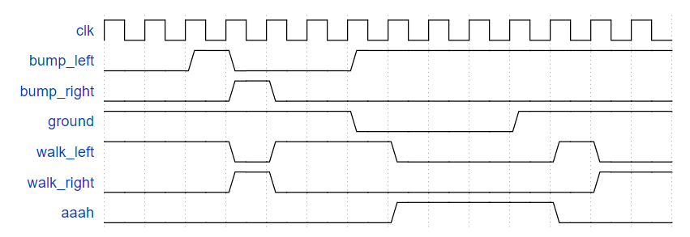

# Circuits -> Sequential Logic -> Finite State Machines

## -1 写在前面
- [119-127](./readme_0.md)
- [128-134](./readme_1.md)
- [135-141](./readme_2.md)
- [142-151](./readme_3.md)

## 128 Lemmings 1
<details>
<summary>详情</summary>

Lemmings 游戏涉及大脑相当简单的小动物。如此简单，我们将使用有限状态机对其进行建模。  
在旅鼠的 2D 世界中，旅鼠可以处于以下两种状态之一：向左行走或向右行走。
如果遇到障碍物，它会切换方向。特别是，如果 Lemming 撞到左边，它会向右走。如果它撞到右边，它会向左走。如果同时撞到两边，还是会换方向。 

实现一个具有两个状态、两个输入和一个输出的摩尔状态机来模拟这种行为。  
  

**分析**  
重置，旅鼠向左走。  
向左走，遇到bump_left，则向右走。    

**答案**  
```
module top_module(
    input clk,
    input areset,    // Freshly brainwashed Lemmings walk left.
    input bump_left,
    input bump_right,
    output walk_left,
    output walk_right); //  

    parameter LEFT=0, RIGHT=1;
    reg state, next_state;

    always @(*) begin
        case(state)
            LEFT: next_state = bump_left ? RIGHT : LEFT;
            RIGHT: next_state = bump_right ? LEFT : RIGHT;
            default: next_state = LEFT;
        endcase
    end

    always @(posedge clk, posedge areset) begin
        if (areset) state <= LEFT;
        else state <= next_state;
    end

    // Output logic
    assign walk_left = (state == LEFT);
    assign walk_right = (state == RIGHT);

endmodule
```

</details>

## 129 Lemmings 2
<details>
<summary>详情</summary>

除了左右行走之外，如果地面消失在旅鼠脚下，旅鼠还会摔倒（并且可能会“啊啊！”）。  
除了左右行走和碰撞时改变方向，当ground=0时，旅鼠会摔倒并说“啊啊！”。
当地面重新出现时（地面=1），旅鼠将继续沿与坠落前相同的方向行走。
跌倒时被撞不影响行走方向，与地面消失（但尚未跌倒）同一个周期被撞，或仍在跌落中重新出现时，也不影响行走方向。
   

**分析**  
本题难点在于，如何保存左右行走的状态。  
直接无脑空中左行走、空中右行走。

**答案**  
```
module top_module(
    input clk,
    input areset,    // Freshly brainwashed Lemmings walk left.
    input bump_left,
    input bump_right,
    input ground,
    output walk_left,
    output walk_right,
    output aaah ); 
    
    parameter LEFT=2'b00, RIGHT=2'b01, down_l=2'b10, down_r=2'b11;
    reg [1:0] state, next_state;

    always @(*) begin
        case(state)
            LEFT: next_state = ground ? (bump_left ? RIGHT : LEFT) : down_l;
            RIGHT: next_state = ground ? (bump_right ? LEFT : RIGHT) : down_r;
            down_l: next_state = ground ? LEFT : down_l;
            down_r: next_state = ground ? RIGHT : down_r;
            default: next_state = LEFT;
        endcase
    end

    always @(posedge clk, posedge areset) begin
        if (areset) state <= LEFT;
        else state <= next_state;
    end

    // Output logic
    assign walk_left = (state == LEFT);
    assign walk_right = (state == RIGHT);
    assign aaah = (state == down_l | state == down_r);
    
endmodule
```

</details>

## 130 Lemmings 3
<details>
<summary>详情</summary>

除了步行和跌倒之外，有时还可以告诉诱饵做有用的事情，例如挖掘（挖掘= 1时它开始挖掘）。
如果旅鼠当前在地面上行走（地面=1 并且没有下落），它可以挖掘，并且会继续挖掘直到它到达另一边（地面=0）。
到那时，由于没有地面，它会掉下来（啊啊！），然后一旦再次撞到地面，就继续沿原来的方向行走。
与坠落一样，挖掘时被撞到没有效果，并且在坠落或没有地面时被告知要挖掘被忽略。
 
  

**分析**  
于129类似，再加两个状态。

**答案**  
```
module top_module(
    input clk,
    input areset,    // Freshly brainwashed Lemmings walk left.
    input bump_left,
    input bump_right,
    input ground,
    input dig,
    output walk_left,
    output walk_right,
    output aaah,
    output digging ); 
    
    parameter LEFT=3'b000, RIGHT=3'b001, down_l=3'b010, down_r=3'b011, DIG_L=3'b100, DIG_R=3'b101;
    reg [2:0] state, next_state;

    always @(*) begin
        case(state)
            LEFT: next_state = ground ? (dig ? DIG_L : (bump_left ? RIGHT : LEFT)) : down_l;
            RIGHT: next_state = ground ? (dig ? DIG_R : (bump_right ? LEFT : RIGHT)) : down_r;
            DIG_L : next_state = ground ? DIG_L : down_l;
            DIG_R : next_state = ground ? DIG_R : down_r;
            down_l: next_state = ground ? LEFT : down_l;
            down_r: next_state = ground ? RIGHT : down_r;
            default: next_state = LEFT;
        endcase
    end

    always @(posedge clk, posedge areset) begin
        if (areset) state <= LEFT;
        else state <= next_state;
    end

    // Output logic
    assign walk_left = (state == LEFT);
    assign walk_right = (state == RIGHT);
    assign aaah = (state == down_l | state == down_r);
    assign digging = (state == DIG_L | state == DIG_R);

endmodule
```

</details>

## 131 Lemmings 4
<details>
<summary>详情</summary>

虽然旅鼠可以行走、跌倒和挖掘，但旅鼠并非无懈可击。  
如果旅鼠跌落太久然后撞到地面，它可能会飞溅。
特别是，如果 Lemming 跌落超过 20 个时钟周期然后撞到地面，它会飞溅并停止行走、跌落或挖掘（所有 4 个输出变为 0），永远（或直到 FSM 重置）。
旅鼠在落地前可以坠落的距离没有上限。旅鼠只有在落地时才会飞溅；它们不会在半空中飞溅。  

  

**分析**  
多一个计数器，多一个状态。

**答案**  
```
module top_module(
    input clk,
    input areset,    // Freshly brainwashed Lemmings walk left.
    input bump_left,
    input bump_right,
    input ground,
    input dig,
    output walk_left,
    output walk_right,
    output aaah,
    output digging ); 
    
    parameter LEFT=3'b000, 
    		  RIGHT=3'b001, 
    	      down_l=3'b010, 
    		  down_r=3'b011, 
    		  DIG_L=3'b100, 
    		  DIG_R=3'b101,
    		  DIE = 3'b111;
    reg [2:0] state, next_state;
    reg [4:0] cnt;

    always @(*) begin
        case(state)
            LEFT: next_state = ground ? (dig ? DIG_L : (bump_left ? RIGHT : LEFT)) : down_l;
            RIGHT: next_state = ground ? (dig ? DIG_R : (bump_right ? LEFT : RIGHT)) : down_r;
            DIG_L : next_state = ground ? DIG_L : down_l;
            DIG_R : next_state = ground ? DIG_R : down_r;
            down_l: next_state = (cnt == 5'd20) ? (ground ? DIE : down_l) : (ground ? LEFT : down_l);
            down_r: next_state = (cnt == 5'd20) ? (ground ? DIE : down_r) : (ground ? RIGHT : down_r);
            DIE: next_state = DIE;
            default: next_state = LEFT;
        endcase
    end

    always @(posedge clk, posedge areset) begin
        if (areset) state <= LEFT;
        else state <= next_state;
    end

    always @(posedge clk, posedge areset) begin
        if(areset) cnt <= 5'd0;
        else if (cnt == 5'd20) begin 
            cnt <= cnt;
        end
        else if (state == down_l | state == down_r)
            cnt = cnt + 1'b1;
        else cnt <= 5'd0;
    end

    // Output logic
    assign walk_left = (state == LEFT);
    assign walk_right = (state == RIGHT);
    assign aaah = (state == down_l | state == down_r);
    assign digging = (state == DIG_L | state == DIG_R);

endmodule
```

</details>

## 132 One-hot FSM
<details>
<summary>详情</summary>

给定以下具有 1 个输入和 2 个输出的状态机：   
  
假设此状态机使用 one-hot 编码，其中 state[0] 到 state[9] 分别对应于状态 S0 到 S9。除非另有说明，否则输出为零。

实现状态机的状态转换逻辑和输出逻辑部分（但不是状态触发器）。
您在 state[9:0] 中获得当前状态，并且必须生成 next_state[9:0] 和两个输出。
假设 one-hot 编码，通过检查推导逻辑方程。 （测试台将使用非热输入进行测试，以确保您不会尝试做更复杂的事情）

**分析**  
了解一下按位或。。。

**答案**  
```
module top_module(
    input in,
    input [9:0] state,
    output [9:0] next_state,
    output out1,
    output out2);
    
    assign next_state[0] = ~in & ((|state[4:0]) | (|state[9:7]));
    assign next_state[1] = in & (state[0] | state[8] | state[9]);
    assign next_state[2] = in & state[1];
    assign next_state[3] = in & state[2];
    assign next_state[4] = in & state[3];
    assign next_state[5] = in & state[4];
    assign next_state[6] = in & state[5];
    assign next_state[7] = in & (|state[7:6]);
    assign next_state[8] = ~in & state[5];
    assign next_state[9] = ~in & state[6];
    
    assign out1 = |state[9:8];
    assign out2 = state[9] | state[7];

endmodule
```

</details>

## 133 PS2 packet parser
<details>
<summary>详情</summary>

PS/2 鼠标协议发送三个字节长的消息。
然而，在连续的字节流中，消息的开始和结束位置并不明显。
唯一的指示是每个三字节消息的第一个字节总是有bit[3]=1（但其他两个字节的bit[3]可能是1或0，具体取决于数据）。  
我们想要一个有限状态机，当给定输入字节流时，它将搜索消息边界。
我们将使用的算法是丢弃字节，直到我们看到 bit[3]=1 的字节。
然后我们假设这是消息的字节 1，并在所有 3 个字节都已接收（完成）后发出消息的接收信号。  
FSM 应该在成功接收到每个消息的第三个字节后立即在循环中发出完成信号。
  

**分析**  
丢弃字节。。。瞬间不复杂了。。。  
`仅需注意in[3]为1与done的时序关系`  
rush   

**答案**  
```
module top_module(
    input clk,
    input [7:0] in,
    input reset,    // Synchronous reset
    output done); //

    parameter S0=2'b00,
    		  S1=2'b01,
    		  S2=2'b10,
    		  S3=2'b11;
    
    reg [2:0] state,next_state;
    
    always @(*) begin
        case(state)
            S0: next_state = in[3] ? S1 : S0;
            S1: next_state = S2;
            S2: next_state = S3;
            S3: next_state = in[3] ? S1 : S0;
            default: next_state = S0;
        endcase
    end

    always @(posedge clk) begin
        if (reset) state <= S0;
        else state <= next_state;
    end
    
    assign done = (state==S3);

endmodule
```

</details>

## 134 PS2 packet parser and datapath
<details>
<summary>详情</summary>

现在您有了一个状态机，可以识别 PS/2 字节流中的三字节消息，
添加一个数据路径，该路径也将在收到数据包时输出 24 位（3 字节）消息（out_bytes[23:16]是第一个字节，out_bytes[15:8] 是第二个字节，依此类推）。  
 
  

**分析**  
需注意：当连续的48位数据需要输出时，如何处理out_bytes的赋值时序。  
想法1：  
使用`temp8`中间量，将符合的`in`缓存到`temp8`中，然后用`temp8`对`temp`赋值。  
遇到的问题：  
注意在什么时候用`temp8`对`temp`赋值！！！！  
想法2：  
输出的`out_bytes`，也就是前面的三字节数据，我们可以一直丢弃数据，`out_bytes`不断的左移`8bit`，需要输出的时候输出即可。
  

**答案**  
注释内容为想法1，现内容为想法2。  
```
module top_module(
    input clk,
    input [7:0] in,
    input reset,    // Synchronous reset
    output [23:0] out_bytes,
    output done); //
    
    parameter S0=2'b00,
    		  S1=2'b01,
    		  S2=2'b10,
    		  S3=2'b11;

    reg [2:0] state,next_state;
    //reg [7:0] temp8;
    reg [23:0] temp;

    always @(*) begin
        case(state)
            S0: begin 
                next_state = in[3] ? S1 : S0;
                //temp8 = in[3] ? in : temp8;
            end
            S1: begin 
                next_state = S2;
                //temp8 = in;
            end
            S2: begin 
                next_state = S3;
                //temp8 = in;
            end
            S3: begin
                next_state = in[3] ? S1 : S0;
                //temp8 = in[3] ? in : temp8;
            end
            default: next_state = S0;
        endcase
    end

    always @(posedge clk) begin
        if (reset) begin 
            state <= S0;
        end
        else state <= next_state;
    end
    
    always @(posedge clk) begin
        if (reset) temp <= 23'd0;
        else temp <= {temp[15:0],in};
    end
    
    /*
    always @(posedge clk) begin
        if (reset) temp <= 24'b0;
        else case(next_state)
            S1: temp[23:16] <= temp8;
            S2: temp[15:8] <= temp8;
            S3: temp[7:0] <= temp8;
            default: temp <= temp;
        endcase
    end
    */

    assign done = (state==S3);
    assign out_bytes = temp;

endmodule
```

</details>


