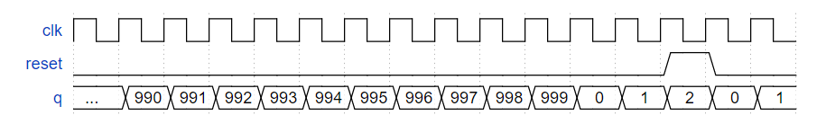
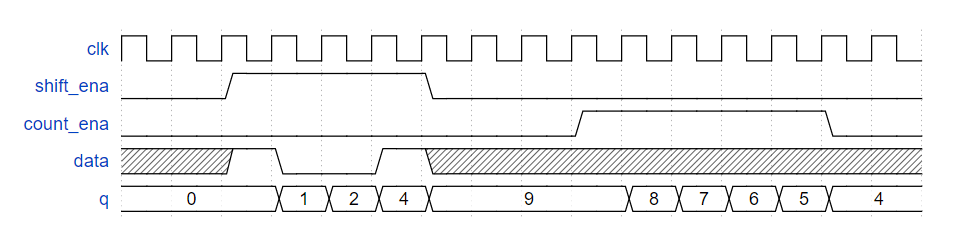
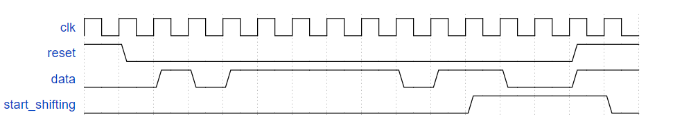
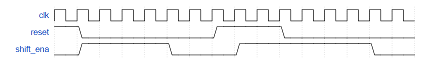
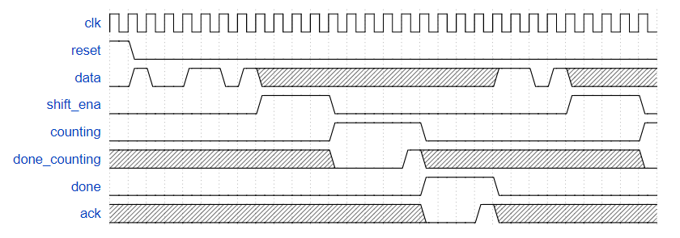
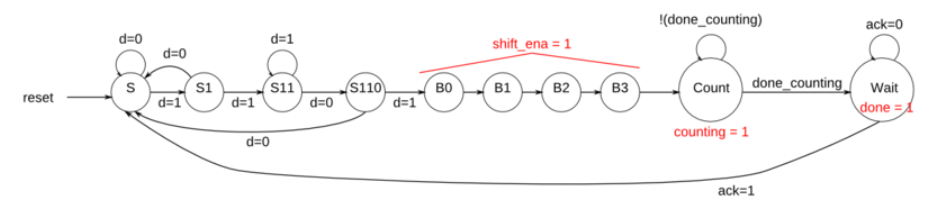

# Circuits -> Building Larger Circuits

## 152 Counter with period 1000
<details>
<summary>详情</summary>

建立一个从 0 到 999 的计数器，包括 0 到 999，周期为 1000 个周期。复位输入是同步的，应将计数器复位为 0 。  

  

**分析**  
经过前面的锻炼，应该没什么问题。  

**答案**  
```
module top_module (
    input clk,
    input reset,
    output [9:0] q);
    
    reg [9:0] q_temp;
    
    always @(posedge clk) begin
        if (reset) q_temp <= 10'b0;
        else if (q_temp == 10'd999) q_temp <= 10'b0;
        else q_temp <= q_temp + 1'b1;
    end
    
    assign q = q_temp;

endmodule
```

</details>

## 153 4-bit shift register and down counter
<details>
<summary>详情</summary>

构建一个四位移位寄存器，该寄存器也用作递减计数器。
当 shift_ena 为 1 时，数据首先移入最高有效位。
当 count_ena 为 1 时，当前在移位寄存器中的数字递减。
由于整个系统不会同时使用 shift_ena 和 count_ena，因此您的电路无关紧要如果两个控制输入都为 1（这主要意味着哪种情况获得更高优先级并不重要）。  

   

**分析**  
虽然是做题，能跑就行。  
博主还是希望可以各位不要用减法，使用加法完成减法。  
`对FPGA而言，减法在综合的时候，所用资源会很多`。  

**答案**  
```
module top_module (
    input clk,
    input shift_ena,
    input count_ena,
    input data,
    output [3:0] q);
    
    reg [3:0] q_temp=4'b0;

    always @(posedge clk) begin
        if (shift_ena) q_temp <= {q_temp[2:0], data};
        if (count_ena) q_temp <= q_temp + 4'b1111;
    end

    assign q = q_temp;

endmodule
```

</details>

## 154 FSM - Sequence 1101 recognizer
<details>
<summary>详情</summary>

构建一个有限状态机，在输入比特流中搜索序列 1101。找到序列后，应将 start_shifting 设置为 1，直到重置。  

  

**分析**  
注意一下这里的1101是重叠检测。

**答案**  
```
module top_module (
    input clk,
    input reset,      // Synchronous reset
    input data,
    output start_shifting);
    
    parameter A=3'b000,
    		  B=3'b001,
    		  C=3'b010,
    		  D=3'b011,
    		  E=3'b100;
    
    reg [2:0] state,next_state;
    
    always @(*) begin
        case(state)
            A: next_state = data ? B : A;
            B: next_state = data ? C : A;
            C: next_state = data ? C : D;
            D: next_state = data ? E : A;
            E: next_state = E;
            default: next_state = A;
        endcase
    end
    
    always @(posedge clk) begin
        if (reset) state <= A;
        else state <= next_state;
    end
    
    assign start_shifting = (state==E);
    
endmodule
```

</details>

## 155 FSM - Enable shift register
<details>
<summary>详情</summary>

作为用于控制移位寄存器的 FSM 的一部分，我们希望能够在检测到正确的位模式时，启用4 个时钟周期的移位寄存器。  

  

**分析**  
这部分单独拿出来感觉怪怪的。。。

**答案**  
```
module top_module (
    input clk,
    input reset,      // Synchronous reset
    output shift_ena);
    
    parameter A=3'b000,
    		  B=3'b001,
    		  C=3'b010,
    		  D=3'b011,
    		  E=3'b100;

    reg [2:0] state,next_state;

    always @(*) begin
        case(state)
            A: next_state = B;
            B: next_state = C;
            C: next_state = D;
            D: next_state = E;
            E: next_state = E;
            default: next_state = A;
        endcase
    end

    always @(posedge clk) begin
        if (reset) state <= A;
        else state <= next_state;
    end

    assign shift_ena = ~(state==E);

endmodule
```

</details>

## 156 FSM - The complete FSM
<details>
<summary>详情</summary>

我们想创建一个计时器：
- 当检测到特定模式 (1101) 时开始，
- 再移 4 位以确定延迟的持续时间，
- 等待计数器完成计数，并且通知用户并等待用户确认计时器。   

在这个问题中，只实现控制定时器的有限状态机。此处不包括数据路径（计数器和一些比较器）。  
串行数据在数据输入引脚上可用。当接收到模式 1101 时，状态机必须输出正好 4 个时钟周期的 shift_ena。  
之后，状态机断言其计数输出以指示它正在等待计数器，并一直等到输入 done_counting 为高。  
此时，状态机必须断言完成以通知用户定时器已超时，并等待直到输入 ack 为 1，然后才被重置以寻找下一次出现的启动序列 (1101)。  
状态机应重置为开始搜索输入序列 1101 的状态。  

  

**分析**  
eeemmmm，博主本来想把上两题的结果拼接过来，没成功。。。  
整成一个FSM把。。。

**答案**  
```
module top_module (
    input clk,
    input reset,      // Synchronous reset
    input data,
    output shift_ena,
    output counting,
    input done_counting,
    output done,
    input ack );
    
    parameter A=4'b0000,B=4'b0001,
    		  C=4'b0010,D=4'b0011,
    		  E=4'b0100,F=4'b0101,
    		  H=4'b0110,I=4'b0111,
    		  M=4'b1000,N=4'b1001;

    reg [3:0] state,next_state;

    always @(*) begin
        case(state)
            A: next_state = data ? B : A;
            B: next_state = data ? C : A;
            C: next_state = data ? C : D;
            D: next_state = data ? E : A;
            E: next_state = F;
            F: next_state = H;
            H: next_state = I;
            I: next_state = M;
            M: next_state = done_counting ? N : M;
            N: next_state = ack ? A : N;
            default: next_state = A;
        endcase
    end

    always @(posedge clk) begin
        if (reset) state <= A;
        else state <= next_state;
    end

    assign shift_ena = (state==E | state==F | state==H | state==I);
    assign counting = (state==M);
    assign done = (state==N);

endmodule
```

</details>

## 157 The complete timer
<details>
<summary>详情</summary>

整体功能和上一题差不多。这里补充说明下之前不清晰的地方。

- 当接收到数据为 1101 时，电路必须移入接下来的 4 位，首先是最高有效位。这 4 位决定了定时器延迟的`持续时间`。我将此称为 delay[3:0]。
- 状态机置高 counting 信号，表示其正在等待计数器完成计数。计数周期为 `（delay[3:0] + 1 ）* 1000` 个时钟周期 。
- 输出 count 当前剩余的计数周期，输出`当前剩余计数周期的千位`（比如，还剩1000个周期输出 1，还剩 999 个周期时输出 0）
- 当计数完成后，电路置高 done 信号通知上层应用计数器计数完成，等待 ack 信号置高后，状态机清除 done 信号，返回空闲状态等待捕获下一个 1101 序列。  

  

**分析**  
上述第一点和第三点，可以发现输出的count也就是delay的值，自减一就行。  
总的来说就是把上一题的done_counting怎么进行的展开来写一些。  
`不要用减法！`  

**答案**  
```
module top_module (
    input clk,
    input reset,      // Synchronous reset
    input data,
    output [3:0] count,
    output counting,
    output done,
    input ack );
    
    parameter A=4'b0000,B=4'b0001,
    		  C=4'b0010,D=4'b0011,
    		  E=4'b0100,F=4'b0101,
    		  H=4'b0110,I=4'b0111,
    		  M=4'b1000,N=4'b1001;

    reg [3:0] state,next_state;
	wire shift_ena;
    wire done_counting;

    always @(*) begin
        case(state)
            A: next_state = data ? B : A;
            B: next_state = data ? C : A;
            C: next_state = data ? C : D;
            D: next_state = data ? E : A;
            E: next_state = F;
            F: next_state = H;
            H: next_state = I;
            I: next_state = M;
            M: next_state = done_counting ? N : M;
            N: next_state = ack ? A : N;
            default: next_state = A;
        endcase
    end

    always @(posedge clk) begin
        if (reset) state <= A;
        else state <= next_state;
    end
    
    reg [3:0] temp;
    always @(posedge clk) begin
        if (reset) temp <= 4'b0;
        else if (shift_ena) temp <= {temp[2:0], data};
        else if (cnt == 32'd999) temp <= temp + 4'b1111;
    end
    
    reg [31:0] cnt;
    always @(posedge clk) begin
        if (reset | cnt == 32'd999) cnt <= 32'b0;
        else if (counting) cnt <= cnt + 1'b1;
        else cnt <= 32'b0;
    end
    
    assign done_counting = (temp == 0) & (cnt == 32'd999); 
    assign shift_ena = (state==E | state==F | state==H | state==I);
    assign counting = (state==M);
    assign done = (state==N);
    assign count = temp;

endmodule
```

</details>

## 158 FSM - One-hot logic equations
<details>
<summary>详情</summary>

给定以下具有 3 个输入、3 个输出和 10 个状态的状态机。   
  

假设使用以下 one-hot 编码，通过检查导出下一状态逻辑方程和输出逻辑方程： (S, S1, S11, S110, B0, B1, B2, B3, Count, Wait) = (10'b0000000001, 10 'b0000000010, 10'b0000000100, ... , 10'b1000000000)

本题仅要求产生以下状态的状态转移信号：
- B3_next ：next_B3_state?
- S_next
- S1_next
- Count_next

以及下列输出信号
- done
- counting
- shift_ena


**分析**  
中国式英语害死人。。。  

**答案**  
```
module top_module(
    input d,
    input done_counting,
    input ack,
    input [9:0] state,    // 10-bit one-hot current state
    output B3_next,
    output S_next,
    output S1_next,
    output Count_next,
    output Wait_next,
    output done,
    output counting,
    output shift_ena
); //

    // You may use these parameters to access state bits using e.g., state[B2] instead of state[6].
    parameter S=0, S1=1, S11=2, S110=3, B0=4, B1=5, B2=6, B3=7, Count=8, Wait=9;

    assign B3_next = state[B2];
    assign S_next = (state[S]&~d) | (state[S1]&~d) | (state[S110]&~d) | (state[Wait]&ack);
    assign S1_next = state[S] & d;
    assign Count_next = (state[B3]) | (state[Count]&~done_counting);
    assign Wait_next = (state[Count]&done_counting) | (state[Wait]&~ack);
    assign done = state[Wait];
    assign counting = state[Count];
    assign shift_ena = state[B0] | state[B1] | state[B2] | state[B3];

endmodule
```

</details>

