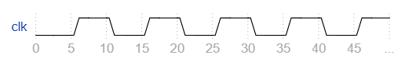
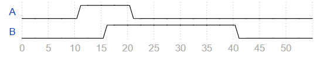
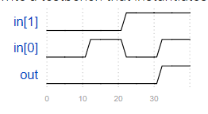
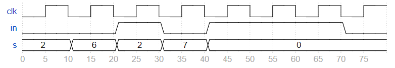

# Verification - Writing Testbenches

## 174 Clock
<details>
<summary>详情</summary>

编写一个测试平台，创建一个module dut 实例（具有任何实例名称），并创建一个时钟信号来驱动模块的 clk 输入。
时钟的周期为 10 ps。时钟应初始化为零，其第一次转换为 0 到 1。  
`module dut ( input clk ) ;`  

  

**分析**  
- 逻辑设计中输入对应 reg 型。  
- 使用 initial 或 always 语句产生激励。  

**答案**  
```
`timescale 1ps / 1ps
module top_module ( );
    parameter timer=5;
    
    reg clk;
    dut u_dut( .clk(clk) ) ;
    
    initial begin 
        clk = 0;
    end
    
    always begin 
        # timer
        clk = ~clk;
    end 

endmodule
```

</details>

## 175 Testbench1
<details>
<summary>详情</summary>

创建一个 Verilog 测试平台，它将为输出 A 和 B 生成以下波形。  

  

**分析**  
无。  

**答案**  
```
`timescale 1ps / 1ps
module top_module ( output reg A, output reg B );//
	
    // generate input patterns here
    initial begin
        A = 1'b0;
        B = 1'b0;
        #10
        A = 1'b1;
        #5
        B = 1'b1;
        #5
        A = 1'b0;
        #20
		B = 1'b0;
    end

endmodule
```

</details>

## 176 AND gate
<details>
<summary>详情</summary>

您将获得以下要测试的 AND 门：  
```
module andgate (
    input [1:0] in,
    output out
);
```

通过生成以下时序图，编写一个实例化此 AND 门并测试所有 4 个输入组合的测试平台:  

  

**分析**  
- 逻辑设计中输入对应 reg 型。
- 逻辑设计中输出对应 wire 型。

**答案**  
```
`timescale 1ps / 1ps
module top_module();
	
    reg [1:0] in;
    wire out;
    
    andgate u_andgate(in, out);
    
    initial begin
        in = 2'b0;
        #10 in = 2'b01;
        #10 in = 2'b10;
        #10 in = 2'b11;
    end
     
endmodule
```

</details>

## 177 Testbench2
<details>
<summary>详情</summary>

提供以下时序和模块：    
```
module q7 (
    input clk,
    input in,
    input [2:0] s,
    output out
);
```

  

编写一个测试平台，实例化模块 q7 并生成这些输入信号，如上图所示。  

**分析**  
- 逻辑设计中输入对应 reg 型。  
- 逻辑设计中输出对应 wire 型。  

**答案**  
```
`timescale 1ps / 1ps
module top_module();
	
    reg clk;
    reg [2:0] s;
    reg in;
    wire out;

    q7 u_q7(clk, in, s, out);

    initial begin
        clk = 1'b0;
        in = 1'b0;
        s = 2;
        #10 
        s = 6;
        #10 
        in = 1;
        s = 2;
        #10
        in = 0;
        s = 7;
        #10
        in = 1;
        s = 0;
        #30
        in = 0;
    end
    
    always #5 clk = ~clk;

endmodule
```

</details>

## 178 T flip-flop
<details>
<summary>详情</summary>

给定一个 T 触发器模块，其声明如下：  
```
module tff (
    input clk,
    input reset,   // active-high synchronous reset
    input t,       // toggle
    output q
);
```

Write a testbench that instantiates one tff and will reset the T flip-flop then toggle it to the "1" state.  

**分析**  
产生一个复位。  

**答案**  
```
`timescale 1ps / 1ps
module top_module ();
    reg clk,reset,t;
    wire q;
    
    tff u_tff (clk, reset, t, q);
    
    initial begin
        clk = 0;
        reset = 0;
        #5
        reset = 1;
        #5
        reset = 0;
    end
    
    always #5 clk = ~clk;
    
    always @(posedge clk) begin
        if (reset) t <= 0;
        else t <= 1;
    end

endmodule
```

</details>
